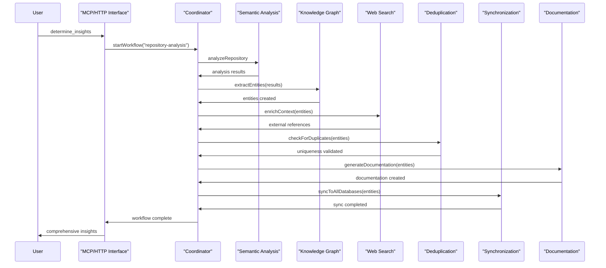
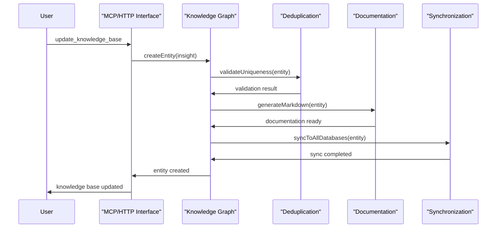
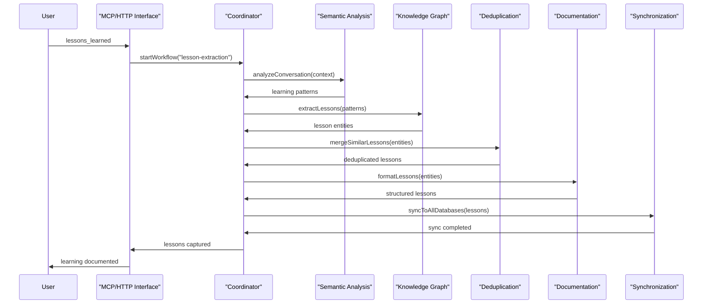

# Unified 8-Agent System Architecture

## Overview

The unified semantic analysis system consists of **8 specialized agents** that work together to provide comprehensive code analysis, knowledge extraction, and intelligent insights. This same agent system serves both Claude Code (via MCP tools) and GitHub CoPilot (via VSCode integration), ensuring consistent analysis quality regardless of the AI coding assistant being used.

## Agent System Philosophy

### 1. **Single Agent Infrastructure**
- All AI coding assistants use the **same agents**
- Consistent analysis algorithms and logic
- Shared knowledge base and insights
- Unified command interface

### 2. **Specialized Agent Roles**
- Each agent has a specific responsibility
- Direct Node.js/TypeScript function calls for optimal performance
- No messaging overhead - agents communicate via direct method invocation
- Coordinator orchestrates complex workflows

### 3. **Fault Tolerance & Resilience**
- Agents can operate independently when others fail
- Graceful degradation of functionality
- Automatic recovery and retry mechanisms
- Health monitoring and diagnostics

## 8-Agent Architecture


### 1. Coordinator Agent
**Role**: Workflow orchestration and management
**Responsibilities**:
- Start and manage complex multi-agent workflows
- Track progress and handle errors
- Coordinate between different agents
- Provide status reporting and monitoring

```typescript
interface CoordinatorAgent {
  startWorkflow(type: WorkflowType, params: WorkflowParams): Promise<WorkflowResult>;
  getWorkflowStatus(workflowId: string): Promise<WorkflowStatus>;
  scheduleTask(task: ScheduledTask): Promise<TaskSchedule>;
  cancelWorkflow(workflowId: string): Promise<void>;
}
```

### 2. Semantic Analysis Agent
**Role**: Core code and conversation analysis
**Responsibilities**:
- Repository commit analysis
- Conversation log processing  
- Pattern recognition in code changes
- Significance scoring and classification

```typescript
interface SemanticAnalysisAgent {
  analyzeRepository(params: RepoAnalysisParams): Promise<AnalysisResult>;
  analyzeConversation(params: ConversationParams): Promise<ConversationInsights>;
  extractPatterns(code: string[]): Promise<CodePattern[]>;
  scoreSignificance(change: CodeChange): Promise<number>;
}
```

### 3. Knowledge Graph Agent
**Role**: Entity and relationship management
**Responsibilities**:
- Extract structured entities from analysis
- Create and manage relationships
- Maintain graph structure integrity
- Handle entity lifecycle operations

```typescript
interface KnowledgeGraphAgent {
  createEntity(entity: KnowledgeEntity): Promise<EntityResult>;
  createRelationship(from: string, to: string, type: string): Promise<RelationshipResult>;
  updateEntity(id: string, updates: Partial<KnowledgeEntity>): Promise<EntityResult>;
  searchEntities(query: SearchQuery): Promise<EntitySearchResult[]>;
}
```

### 4. Web Search Agent
**Role**: External documentation and research
**Responsibilities**:
- Search technical documentation
- Find relevant external resources
- Validate technical claims
- Enrich context with external knowledge

```typescript
interface WebSearchAgent {
  searchTechnicalDocs(technology: string, topic: string): Promise<DocumentationResult[]>;
  searchWeb(query: string, domains?: string[]): Promise<WebSearchResult[]>;
  validateTechnicalClaim(claim: string): Promise<ValidationResult>;
  enrichContext(entities: KnowledgeEntity[]): Promise<EnrichedEntity[]>;
}
```

### 5. SynchronizationAgent (CRITICAL)
**Role**: Single source of truth for data integrity
**Responsibilities**:
- Ensure consistency across all databases
- Handle conflict resolution
- Manage multi-database synchronization
- Provide atomic operations across storage systems

```typescript
interface SynchronizationAgent {
  syncToAllDatabases(entity: KnowledgeEntity): Promise<SyncResult>;
  resolveConflicts(conflicts: EntityConflict[]): Promise<ConflictResolution>;
  validateConsistency(): Promise<ConsistencyReport>;
  performRecoverySync(): Promise<RecoveryResult>;
}
```

### 6. Deduplication Agent
**Role**: Prevent duplicate insights and maintain quality
**Responsibilities**:
- Detect similar or duplicate entities
- Prevent redundant knowledge creation
- Merge similar insights
- Maintain knowledge base quality

```typescript
interface DeduplicationAgent {
  checkForDuplicates(entity: KnowledgeEntity): Promise<DuplicateCheckResult>;
  findSimilarEntities(entity: KnowledgeEntity): Promise<SimilarityResult[]>;
  mergeEntities(entities: KnowledgeEntity[]): Promise<MergedEntity>;
  validateUniqueness(entities: KnowledgeEntity[]): Promise<UniquenessReport>;
}
```

### 7. Documentation Agent
**Role**: Create structured documentation and reports
**Responsibilities**:
- Generate markdown documentation
- Create diagrams and visualizations
- Format insights consistently
- Maintain documentation templates

```typescript
interface DocumentationAgent {
  generateMarkdown(entity: KnowledgeEntity): Promise<string>;
  createDiagram(type: DiagramType, data: any): Promise<DiagramResult>;
  formatInsight(insight: RawInsight): Promise<FormattedInsight>;
  applyTemplate(templateName: string, data: any): Promise<string>;
}
```

## Agent Communication Architecture

### Direct Node.js Function Calls (High Performance)
```typescript
// Direct method invocation - no messaging overhead
const workflow = await coordinator.startWorkflow('repository-analysis', params);
const analysis = await semantic.analyzeRepository(repository);
const entities = await knowledge.createEntity(entity);
const syncResult = await sync.resolveConflicts(conflicts);
const docs = await documentation.generateMarkdown(content);
```

### Agent Interface Pattern
```typescript
interface Agent {
  name: string;
  capabilities: string[];
  execute(task: Task): Promise<Result>;
  validate(input: any): Promise<boolean>;
}

// All agents implement this interface for consistency
class CoordinatorAgent implements Agent {
  async execute(task: Task): Promise<Result> {
    // Direct function calls to other agents
    return await this.orchestrateWorkflow(task);
  }
}
```

## Unified Command Workflows

### 1. "determine_insights" Workflow



### 2. "update_knowledge_base" Workflow



### 3. "lessons_learned" Workflow



## Infrastructure Components

### MCP Server (Node.js/TypeScript)
```yaml
# Configuration
server:
  protocol: stdio  # MCP protocol over stdio
  runtime: node.js
  language: typescript
  entrypoint: dist/index.js
  
agents:
  - coordinator
  - semantic-analyzer
  - repository-analyzer
  - knowledge-manager
  - web-search
  - synchronization
  - deduplication
  - documentation
```

### Tool Registry
```typescript
// MCP tool registration
interface MCPTool {
  name: string;
  description: string;
  inputSchema: object;
  handler: (params: any) => Promise<any>;
}

// 12 registered MCP tools
const tools: MCPTool[] = [
  'heartbeat', 'test_connection',
  'determine_insights', 'analyze_code', 'analyze_repository', 'extract_patterns',
  'create_ukb_entity_with_insight', 'execute_workflow',
  'generate_documentation', 'create_insight_report', 
  'generate_plantuml_diagrams', 'generate_lessons_learned'
];
```

### Health Monitoring
```typescript
interface AgentHealth {
  agentId: string;
  status: 'healthy' | 'degraded' | 'unhealthy';
  lastHeartbeat: string;
  capabilities: string[];
  performance: {
    avgResponseTime: number;
    requestCount: number;
    errorRate: number;
  };
}

interface SystemHealth {
  overall: 'healthy' | 'degraded' | 'unhealthy';
  agents: AgentHealth[];
  infrastructure: {
    mcp: { status: string; latency: number };
    llmProviders: { status: string; provider: string }[];
  };
  lastCheck: string;
}
```

## Agent Configuration

### Global Configuration
```yaml
# semantic-analysis-system/config/agents.yaml
agents:
  coordinator:
    enabled: true
    maxConcurrentWorkflows: 5
    defaultTimeout: 300000
    
  semantic:
    enabled: true
    analysisDepth: 10
    significanceThreshold: 7
    
  knowledge:
    enabled: true
    maxEntitiesPerBatch: 50
    validationStrict: true
    
  web:
    enabled: true
    searchTimeout: 10000
    maxResults: 20
    allowedDomains: ["docs.", "github.com", "stackoverflow.com"]
    
  synchronization:
    enabled: true
    adapters:
      mcp: true
      graphology: true
      file: true
    conflictResolution: timestamp_wins
    
  deduplication:
    enabled: true
    similarityThreshold: 0.8
    mergeStrategy: preserve_both
    
  documentation:
    enabled: true
    templates: ["insight", "pattern", "lesson"]
    outputFormat: markdown
```

### Individual Agent Configuration
```yaml
# semantic-analysis-system/config/semantic-agent.yaml
semantic:
  analysis:
    patterns:
      enabled: true
      minSignificance: 5
    conversations:
      enabled: true
      contextWindow: 1000
    repository:
      commitDepth: 20
      fileTypes: [".js", ".ts", ".py", ".md"]
  
  scoring:
    significance:
      architecture: 9-10
      patterns: 7-9
      bugs: 4-6
      style: 1-3
```

## Deployment Architecture

### MCP Server Deployment
```bash
# Simple installation and startup
cd integrations/mcp-server-semantic-analysis
npm install
npm run build

# Configure environment
echo "ANTHROPIC_API_KEY=sk-ant-your-key" > .env
echo "OPENAI_API_KEY=sk-your-key" >> .env

# Start MCP server (used by Claude Code)
npm run dev
```

### Integration with Claude Code
```json
// claude-code-mcp.json configuration
{
  "mcpServers": {
    "semantic-analysis": {
      "command": "node",
      "args": ["/path/to/integrations/mcp-server-semantic-analysis/dist/index.js"],
      "env": {
        "ANTHROPIC_API_KEY": "sk-ant-your-key"
      }
    }
  }
}
```

### Production Deployment
```dockerfile
# Dockerfile for production
FROM node:20-alpine
WORKDIR /app
COPY package*.json ./
RUN npm ci --only=production
COPY dist/ ./dist/
COPY templates/ ./templates/
CMD ["node", "dist/index.js"]
```

## Performance and Scaling

### Performance Metrics
```typescript
interface PerformanceMetrics {
  agents: Record<string, {
    requestsPerSecond: number;
    avgResponseTime: number;
    errorRate: number;
    memoryUsage: number;
    cpuUsage: number;
  }>;
  workflows: {
    avgCompletionTime: number;
    successRate: number;
    concurrent: number;
  };
  communication: {
    mcpLatency: number;
    functionCallLatency: number;
    requestRate: number;
  };
}
```

### Scaling Strategies
1. **Horizontal Scaling**: Run multiple MCP server instances with load balancing
2. **Load Balancing**: Distribute MCP requests across server instances
3. **Caching**: Cache frequently accessed entities and LLM responses
4. **Async Processing**: Use Node.js async/await for non-blocking operations

## Troubleshooting

### Common Issues

#### 1. Agent Execution Failures
**Symptoms**: Agents not responding, workflow timeouts
**Diagnosis**:
```bash
# Check MCP server logs
tail -f integrations/mcp-server-semantic-analysis/logs/server.log
# Test MCP connection
mcp__semantic-analysis__test_connection()
# Check agent health
mcp__semantic-analysis__heartbeat()
```

#### 2. Synchronization Conflicts
**Symptoms**: Inconsistent data across databases
**Diagnosis**:
```bash
# Check sync agent status
curl http://localhost:8765/api/sync/status
# Review conflict logs
tail -f logs/synchronization.log
```

#### 3. Performance Degradation
**Symptoms**: Slow response times, high resource usage
**Diagnosis**:
```bash
# Monitor system metrics
get_system_status
# Check agent performance
@KM system metrics
```

## Testing

### Integration Testing
```typescript
describe('8-Agent System Integration', () => {
  it('should complete full workflow', async () => {
    const workflow = await coordinator.startWorkflow('repository-analysis', {
      repository: './test-repo',
      depth: 5
    });
    
    const result = await coordinator.waitForCompletion(workflow.id);
    
    expect(result.status).toBe('completed');
    expect(result.entities).toHaveLength(3);
    expect(result.insights).toHaveLength(2);
  });
});
```

### Load Testing
```typescript
describe('Agent System Load Tests', () => {
  it('should handle concurrent workflows', async () => {
    const workflows = await Promise.all(
      Array(10).fill(null).map(() => 
        coordinator.startWorkflow('repository-analysis', testParams)
      )
    );
    
    const results = await Promise.all(
      workflows.map(w => coordinator.waitForCompletion(w.id))
    );
    
    expect(results.every(r => r.status === 'completed')).toBe(true);
  });
});
```

## See Also

- [SynchronizationAgent Details](synchronization-agent.md)
- [MCP Server Setup](mcp-server-setup.md)
- [Unified System Overview](../../architecture/unified-system-overview.md)
- [Agent Communication Protocols](agent-communication.md)