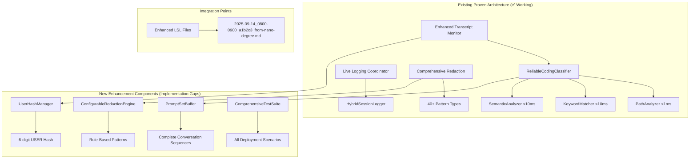

# Live Session Logging System - Consolidated Design Document

## Overview

This consolidated design document integrates the architectural learnings from three completed/implementing specifications (reliable-coding-classifier, enhanced-batch-mode, and comprehensive-live-session-logging) to address the genuine implementation gaps identified in the requirements analysis. The system leverages the proven three-layer classification architecture (PathAnalyzer → KeywordMatcher → SemanticAnalyzer) while adding the missing features: USER environment variable hashing, user prompt set classification, configurable redaction system, and comprehensive testing infrastructure.

**Architecture Foundation**: The system builds upon the successfully implemented ReliableCodingClassifier and enhanced batch processing capabilities, extending them with the missing multi-user and configuration features identified in the comprehensive requirements analysis.

## Steering Document Alignment

### Technical Standards (tech.md)
- **Proven Architecture**: Leverages the successful three-layer classification system from reliable-coding-classifier
- **Configuration-Driven Design**: Extends the existing live-logging-config.json patterns for new configurable redaction features
- **Environment Integration**: Uses established environment variable patterns (USER, TRANSCRIPT_SOURCE_PROJECT) with new USER hashing capability
- **Performance Standards**: Maintains existing <1ms PathAnalyzer, <10ms KeywordMatcher, <10ms SemanticAnalyzer targets

### Project Structure (structure.md)
- **Component Organization**: New components follow established patterns in `/src/live-logging/` and `/scripts/`
- **Configuration Location**: Extensions to existing `/config/live-logging-config.json` with new redaction rules
- **Test Structure**: Comprehensive `/tests/` directory with component-based organization following proven patterns
- **Documentation Alignment**: Updates to existing `/docs/live-session-logging-system.md` with consolidated architecture

## Code Reuse Analysis

### Existing Proven Components to Leverage
- **ReliableCodingClassifier (✅ Implemented)**: Complete three-layer classification system with PathAnalyzer → KeywordMatcher → SemanticAnalyzer architecture
- **Enhanced Transcript Monitor (✅ Working)**: Real-time session monitoring with health tracking and cross-project routing
- **Enhanced Batch Mode (✅ Implemented)**: Fixed batch processing with proper classification integration and foreign mode routing
- **Global LSL Coordinator (✅ Working)**: Central orchestration via live-logging-coordinator.js with HybridSessionLogger integration
- **Comprehensive Redaction System (✅ Working)**: Multi-pattern redaction engine with context-preserving replacements for 40+ sensitive data types

### Integration Points for New Features
- **USER Hash Integration**: Extend existing filename generation in enhanced-transcript-monitor.js with collision-resistant hashing
- **User Prompt Set Processing**: Enhance ReliableCodingClassifier to buffer complete conversation sequences before classification
- **Configurable Redaction**: Transform hard-coded redaction patterns into rule-based configuration system
- **Testing Infrastructure**: Comprehensive test coverage across all deployment scenarios and operational conditions

## Architecture

The consolidated architecture extends the proven LSL system with three key enhancement layers while preserving all existing functionality:

### Modular Design Principles
- **Single Enhancement Responsibility**: Each new component handles one specific gap (USER hashing, prompt set buffering, configurable redaction)
- **Proven Component Extension**: Build upon successful ReliableCodingClassifier and enhanced-transcript-monitor without modification
- **Configuration-Driven Enhancement**: New features controlled via extended configuration files following existing patterns
- **Comprehensive Testing Coverage**: Testing strategy covers all configuration combinations and deployment scenarios



## Components and Interfaces

### Component 1: UserHashFilenameManager (New Implementation)
- **Purpose:** Generate collision-resistant filenames using USER environment variable hashing to prevent multi-user conflicts
- **Interfaces:** 
  - `generateUserHash(username)` -> consistent 6-digit hash
  - `createFilename(date, window, userHash, project)` -> formatted filename string
  - `validateUserEnvironment()` -> environment setup validation
- **Dependencies:** Node.js crypto module for SHA-256 based hashing
- **Reuses:** Existing filename generation logic from enhanced-transcript-monitor.js (lines 823-847)
- **Integration Point:** Extends filename creation in `generateSessionFilename()` method

### Component 2: UserPromptSetProcessor (New Implementation)
- **Purpose:** Buffer complete user interaction sequences (prompt → responses → tool calls → results) for atomic classification
- **Interfaces:**
  - `bufferExchange(exchange)` -> adds exchange to current prompt set
  - `isPromptSetComplete(exchange)` -> detects completion of user interaction sequence
  - `classifyPromptSet(promptSet)` -> classifies complete conversation unit
- **Dependencies:** ReliableCodingClassifier for classification, exchange parsing utilities
- **Reuses:** Existing classification engine with enhanced context understanding
- **Integration Point:** Modifies exchange processing loop in enhanced-transcript-monitor.js around line 541

### Component 3: ConfigurableRedactionEngine (Enhanced Implementation)
- **Purpose:** Transform existing hard-coded redaction patterns into flexible, rule-based configuration system
- **Interfaces:**
  - `loadRedactionConfig(configPath)` -> loads configuration rules from file
  - `applyConfigurableRedaction(text, categories)` -> applies selected redaction categories
  - `validateRedactionRules(rules)` -> validates configuration syntax and patterns
- **Dependencies:** Existing redaction functions, YAML/JSON configuration parsing
- **Reuses:** All 40+ existing redaction patterns from enhanced-transcript-monitor.js (lines 1089-1245)
- **Integration Point:** Replaces `redactSecrets()` function with configurable version

### Component 4: EnhancedBatchProcessor (Performance Enhancement)
- **Purpose:** True parallel processing with date filtering and progress reporting for large transcript datasets
- **Interfaces:**
  - `processConcurrently(files, options)` -> parallel processing with resource management
  - `filterByDateRange(transcripts, dateOption)` -> efficient date-based filtering
  - `reportProgress(completed, total)` -> real-time progress tracking
- **Dependencies:** Node.js worker_threads or cluster for parallelization
- **Reuses:** Existing batch processing logic from generate-proper-lsl-from-transcripts.js
- **Integration Point:** Enhances existing batch processing with true concurrency and filtering

## Data Models

### Enhanced Filename Pattern
```javascript
// Current: 2025-09-14_0800-0900-session-from-nano-degree.md
// Enhanced: 2025-09-14_0800-0900_a1b2c3_from-nano-degree.md
{
  date: "2025-09-14",           // ISO date format
  timeWindow: "0800-0900",      // Hourly window (configurable duration)
  userHash: "a1b2c3",          // 6-digit SHA-256 hash of USER env var
  separator: "_",              // Underscore separator before project name
  sourceProject: "nano-degree", // Source project for foreign mode files
  extension: ".md"             // Markdown format
}
```

### User Prompt Set Model
```javascript
{
  id: string,                   // Unique set identifier
  startTimestamp: number,       // When user prompt was received
  endTimestamp: number,         // When interaction sequence completed
  exchanges: [{                 // Complete conversation sequence
    userMessage: string,        // Initial user prompt
    systemResponses: [string],  // All system-generated responses
    toolCalls: [{              // All tool interactions
      name: string,
      parameters: object,
      result: any
    }]
  }],
  classification: object,       // Applied to entire set as atomic unit
  metadata: {
    totalExchanges: number,     // Count of individual exchanges in set
    classificationTime: number, // Time taken to classify complete set
    containsCodingContent: boolean
  }
}
```

### Configurable Redaction Rules
```yaml
# .specstory/config/redaction-config.yaml
redaction:
  enabled: true
  globalSettings:
    preserveStructure: true     # Maintain JSON/XML/YAML structure
    logRedactionStats: false    # Optional redaction activity logging
  
  categories:
    apiKeys:
      enabled: true
      patterns:
        - pattern: "sk-[a-zA-Z0-9]{20,}"
          replacement: "<SECRET_REDACTED>"
          description: "OpenAI API keys"
        - pattern: "xai-[a-zA-Z0-9]{20,}"
          replacement: "<SECRET_REDACTED>"
          description: "XAI/Grok API keys"
    
    personalInfo:
      enabled: true
      patterns:
        - pattern: "[a-zA-Z0-9._%+-]+@[a-zA-Z0-9.-]+\\.[a-zA-Z]{2,}"
          replacement: "<EMAIL_REDACTED>"
          description: "Email addresses"
        - pattern: "\\bq[0-9a-zA-Z]{6}\\b"
          replacement: "<USER_ID_REDACTED>"
          description: "Corporate user IDs"
    
    corporateInfo:
      enabled: false              # Can be disabled for internal projects
      patterns:
        - pattern: "\\b(BMW|Mercedes|Apple|Google)\\b"
          replacement: "<COMPANY_NAME_REDACTED>"
          description: "Major corporation names"
    
    custom:
      enabled: true
      patterns:
        - pattern: "PROJECT_SPECIFIC_PATTERN"
          replacement: "<CUSTOM_REDACTED>"
          description: "Project-specific sensitive terms"
```

### Enhanced Batch Processing Configuration
```javascript
{
  batchProcessing: {
    maxConcurrency: 4,          // CPU cores - 1 for optimal performance
    dateFiltering: {
      enabled: true,
      defaultMode: "today",     // "today", "yesterday", "week", "range", "all"
      customRange: {
        start: "2025-09-01",
        end: "2025-09-14"
      }
    },
    progressReporting: {
      enabled: true,
      updateInterval: 100,      // Report progress every N files
      detailedStats: true       // Include classification breakdown
    },
    performance: {
      timeoutMs: 300000,        // 5-minute timeout for large batches
      memoryLimitMB: 1024,      // Memory usage ceiling
      enableParallel: true      // Use worker threads/cluster
    }
  },
  userIdHashing: {
    enabled: true,
    fallbackUserId: "default",  // When USER env var not available
    hashAlgorithm: "sha256",    // Cryptographic hash function
    hashLength: 6               // First 6 characters of hash
  }
}
```

## Error Handling

### Error Scenarios

1. **USER Environment Variable Missing:**
   - **Handling:** Use fallback ID "default" with warning log, continue processing
   - **User Impact:** Warning in logs, filename uses default hash, no processing failure
   - **Recovery:** System continues normally, user can set USER later for proper hashing

2. **Configurable Redaction Rule Syntax Error:**
   - **Handling:** Validate rules at startup, reject invalid patterns with specific error details
   - **User Impact:** Clear error message pointing to problematic rule, system starts with working rules only
   - **Recovery:** Fix rule syntax, restart service, or use default hard-coded patterns as fallback

3. **User Prompt Set Buffer Overflow:**
   - **Handling:** Process buffered set when size exceeds threshold, start new set
   - **User Impact:** Slightly reduced context for very long conversations, no data loss
   - **Recovery:** Automatic buffer management prevents memory exhaustion

4. **Parallel Batch Processing Resource Exhaustion:**
   - **Handling:** Dynamically reduce concurrency, fall back to sequential processing if needed
   - **User Impact:** Slower processing speed, progress reporting shows adjusted timeline
   - **Recovery:** Monitor system resources, adjust concurrency based on available memory/CPU

## Testing Strategy

### Unit Testing
- **UserHashFilenameManager**: Test hash consistency, filename format validation, environment variable handling
- **UserPromptSetProcessor**: Test set boundary detection, buffering logic, classification of complete sequences  
- **ConfigurableRedactionEngine**: Test rule parsing, pattern matching, category enable/disable functionality
- **EnhancedBatchProcessor**: Test concurrency management, date filtering accuracy, progress reporting

### Integration Testing
- **End-to-End LSL Generation**: Test complete pipeline from transcript ingestion to final LSL file creation
- **Multi-User Scenarios**: Verify filename collision prevention with different USER environment values
- **Configuration Changes**: Test dynamic configuration updates without service restart
- **Cross-Project Routing**: Validate proper content routing between projects with new filename patterns

### End-to-End Testing

#### Comprehensive E2E Test Matrix
Based on requirements analysis, the testing strategy covers all deployment scenarios and operational conditions:

**Configuration Matrix Testing:**
- **Redaction Combinations**: High/Medium/Low/Custom/Disabled security levels with all pattern categories
- **Classification Variations**: Three-layer enabled, two-layer fallback, single-layer emergency modes
- **User Prompt Set Modes**: Complete prompt sets vs. individual exchange processing
- **Time Management**: Standard hourly, offset windows, custom durations, timezone handling

**Deployment Scenario Testing:**
- **Single Project**: Self-contained LSL within individual projects
- **Multi-Project**: Hub-and-spoke routing to central coding infrastructure
- **Cross-Platform**: macOS, Linux, Windows, container deployments
- **Scale Testing**: Single user low/high volume, multi-user standard/high load, burst scenarios

**Operational Condition Testing:**
- **Network Connectivity**: High-speed, limited bandwidth, intermittent, offline processing
- **Data Volumes**: Small sessions (10-20 exchanges), large sessions (100+ exchanges), complex content
- **Error Conditions**: Process crashes, memory exhaustion, disk full, configuration corruption
- **Recovery Testing**: Automatic recovery, graceful degradation, data consistency, state restoration

### Performance Validation
- **Classification Speed**: Verify Path <1ms, Keyword <10ms, Semantic <10ms targets maintained
- **User Prompt Set Processing**: Measure performance improvement from reduced API calls
- **Batch Processing Throughput**: Validate parallel processing performance gains
- **Memory Efficiency**: Ensure stable memory usage during extended operations

### Security Testing
- **Redaction Effectiveness**: Comprehensive validation of configurable redaction patterns
- **Configuration Security**: Test protection of sensitive configuration data
- **Multi-User Isolation**: Ensure proper data separation in multi-user environments
- **Access Control**: Verify file permissions and secure handling of generated content

## Implementation Strategy

### Phase 1: Core Enhancement Implementation (Weeks 1-2)
- **UserHashFilenameManager**: Implement USER environment variable hashing with collision prevention
- **ConfigurableRedactionEngine**: Transform hard-coded patterns into rule-based system
- **Integration Testing**: Verify filename generation and redaction configuration work correctly

### Phase 2: Advanced Processing Features (Weeks 3-4)
- **UserPromptSetProcessor**: Implement conversation sequence buffering and atomic classification
- **EnhancedBatchProcessor**: Add parallel processing, date filtering, and progress reporting
- **Performance Validation**: Ensure all processing remains within established timing targets

### Phase 3: Comprehensive Testing and Validation (Week 5)
- **E2E Test Suite**: Complete test matrix covering all deployment scenarios and configurations
- **Performance Benchmarking**: Validate all timing requirements and resource usage
- **Security Validation**: Comprehensive redaction effectiveness and access control testing

### Phase 4: Production Deployment and Documentation (Week 6)
- **Production Integration**: Deploy enhanced system with comprehensive monitoring
- **Documentation Updates**: Complete architecture documentation and operational guides
- **User Training**: Provide guidance for new configuration features and multi-user setup

## Quality Assurance Integration

### Automated Quality Gates
- **Code Quality**: ESLint, Prettier, and security scanning for all new components
- **Test Coverage**: Minimum 90% code coverage for all new functionality
- **Performance Benchmarks**: Automated performance regression testing
- **Security Validation**: Automated redaction pattern effectiveness testing

### Continuous Integration
- **Pre-commit Hooks**: Run quality checks before code commits
- **Automated Testing**: Full test suite execution on every code change
- **Performance Monitoring**: Continuous performance metric collection and alerting
- **Configuration Validation**: Automated testing of configuration changes

### Production Monitoring
- **Health Monitoring**: Real-time health checks with comprehensive error tracking
- **Performance Metrics**: Continuous monitoring of classification times and throughput
- **Resource Usage**: Memory, CPU, and disk space monitoring with alerting
- **User Experience**: Monitor filename collision rates and configuration effectiveness

This consolidated design provides a comprehensive blueprint for implementing the identified gaps while leveraging all proven components from the three existing specifications. The approach ensures maximum reuse of working code while adding the missing multi-user, configuration, and testing capabilities required for a production-ready Live Session Logging system.