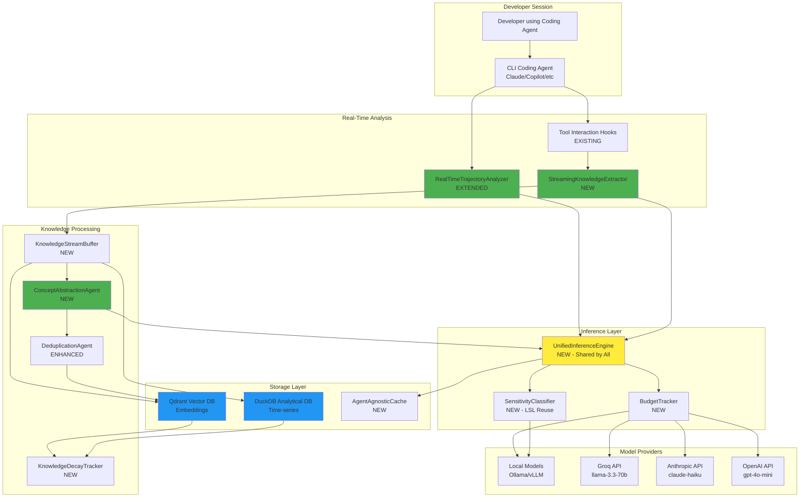
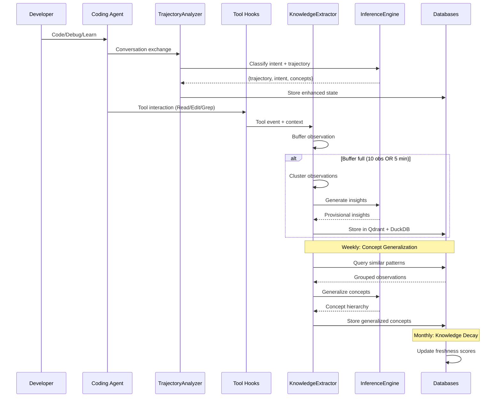
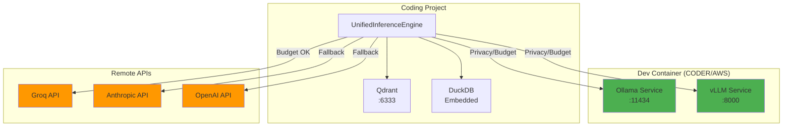

# Design Document: Continuous Learning Knowledge System

**Spec**: `continuous-learning-knowledge-system`
**Phase**: Design
**Created**: 2025-01-18
**Status**: Draft - Awaiting Approval

---

## Overview

The Continuous Learning Knowledge System transforms the existing batch-oriented knowledge management into a real-time, trajectory-aware learning system that extracts knowledge from development sessions, generalizes patterns into reusable concepts, and provides context-aware recommendations while respecting privacy and budget constraints.

### Core Design Principles

1. **Code Reuse Over Duplication**: Extend existing components (trajectory analyzer, semantic validator) rather than creating parallel systems
2. **Agent-Agnostic Architecture**: Work with any CLI-based coding agent through adapter pattern
3. **Privacy-First by Design**: Local models for sensitive data, configurable routing
4. **Budget-Conscious Operations**: Aggressive caching, smart sampling, local-first inference
5. **Modular Components**: Single responsibility, clear interfaces, loose coupling
6. **Graceful Degradation**: System failures don't block development work

---

## Steering Document Alignment

### Technical Standards (tech.md)

**TypeScript & JavaScript**:
- Core inference engine and knowledge management in JavaScript (existing codebase standard)
- MCP semantic analysis agents in TypeScript (existing pattern)
- Type definitions for all public APIs
- ESLint + Prettier for code quality

**Database Architecture**:
- Qdrant for vector/semantic operations (already integrated)
- DuckDB for temporal/analytical queries (embedded, no server needed)
- No PostgreSQL or MongoDB (constraint compliance)

**Error Handling**:
- Circuit breaker pattern for LLM provider failures
- Graceful degradation (skip analysis if services down)
- Comprehensive logging with structured data

**Performance Standards**:
- Real-time operations <2s (p95)
- Database queries <500ms (p95)
- Async/non-blocking for developer workflow
- Caching with 40%+ hit rate

### Project Structure (structure.md)

Following existing coding project organization:

```
coding/
├── src/
│   ├── inference/           # NEW: Unified inference engine
│   ├── databases/           # NEW: Database managers (Qdrant + DuckDB)
│   ├── knowledge-management/ # NEW: Knowledge extraction & management
│   ├── caching/             # NEW: Agent-agnostic cache
│   └── live-logging/        # EXTEND: Add intent classification
├── integrations/
│   └── mcp-server-semantic-analysis/
│       └── src/agents/      # NEW: Streaming extractor, concept abstraction
├── scripts/                 # Existing batch processing, migration scripts
├── docs/                    # Architecture documentation
└── .specstory/
    ├── config/              # NEW: Sensitivity topics, budget limits
    └── trajectory/          # EXTEND: Enhanced state schema
```

---

## Code Reuse Analysis

### Existing Components to Leverage

#### 1. **RealTimeTrajectoryAnalyzer** (`src/live-logging/RealTimeTrajectoryAnalyzer.js`)
**Reuse Strategy**: EXTEND, don't replace
- Keep existing trajectory state classification (exploring, implementing, verifying)
- Add intent classification (learning, debugging, feature-dev)
- Add concept extraction and goal inference
- Share UnifiedInferenceEngine with knowledge system

#### 2. **Semantic Validator Pattern** (`integrations/mcp-constraint-monitor/src/engines/semantic-validator.js`)
**Reuse Strategy**: Generalize into UnifiedInferenceEngine
- Multi-provider support (Groq, Anthropic, OpenAI, Local)
- Circuit breaker pattern
- Caching layer
- Model routing logic
- Extend to support vLLM alongside Ollama

#### 3. **LSL 5-Layer Classification** (`scripts/enhanced-transcript-monitor.js`)
**Reuse Strategy**: Adapt for sensitivity detection
- SessionFilter → Pre-filter for session continuation
- PathClassifier → Detect sensitive file paths
- KeywordClassifier → Detect sensitive keywords
- EmbeddingClassifier → Semantic sensitivity matching
- SemanticAnalyzer → LLM-based final classification

#### 4. **Qdrant Client** (`integrations/mcp-constraint-monitor/src/databases/qdrant-client.js`)
**Reuse Strategy**: Extend for knowledge collections
- Already optimized (HNSW + int8 quantization)
- Add new collections (knowledge_concepts, session_intents, etc.)
- Reuse connection pooling and error handling

#### 5. **MCP Semantic Analysis Agents** (`integrations/mcp-server-semantic-analysis/src/agents/`)
**Reuse Strategy**: Add new agents, keep existing workflow
- GitHistoryAgent, VibeHistoryAgent → unchanged
- CoordinatorAgent → add continuous-learning workflow
- DeduplicationAgent → enhance with embedding similarity
- QualityAssuranceAgent → validate knowledge quality

#### 6. **Tool Interaction Hooks** (`scripts/tool-interaction-hook-wrapper.js`)
**Reuse Strategy**: Subscribe for knowledge extraction
- PostToolUse hook already captures all tool interactions
- Feed to StreamingKnowledgeExtractor
- Extract observations from Read, Edit, Grep, Write, etc.

### Integration Points

#### 1. **LSL System**
- **Connection**: Tool hooks → StreamingKnowledgeExtractor
- **Data Flow**: Tool interactions → Observations → Knowledge base
- **Classification**: Reuse 5-layer system for sensitivity detection

#### 2. **Trajectory System**
- **Connection**: RealTimeTrajectoryAnalyzer → Intent classification
- **Data Flow**: Conversation → Trajectory state + Intent + Concepts
- **Storage**: Live state JSON + DuckDB history + Qdrant embeddings

#### 3. **Constraint Monitor**
- **Connection**: Violations → Knowledge signals
- **Data Flow**: Constraint fired → "User wanted X but violated Y"
- **Budget**: Shared cost pool via UnifiedInferenceEngine

#### 4. **VKB Visualization**
- **Connection**: Read from Qdrant + DuckDB (not JSON)
- **Data Flow**: Databases → Graph nodes + edges → Visualization
- **Adaptation**: Node format per database schema

---

## Architecture

### High-Level System Architecture



### Data Flow Architecture



### Component Interaction Patterns

#### Pattern 1: Shared Inference Engine
**Problem**: Multiple components need LLM inference (trajectory, extraction, generalization)
**Solution**: Single UnifiedInferenceEngine with routing logic
**Benefit**: No duplicate code, centralized cost/privacy control

```javascript
// All components use same engine
const inferenceEngine = new UnifiedInferenceEngine(config);

// Trajectory uses it
trajectoryAnalyzer.classifyIntent(conversation, inferenceEngine);

// Knowledge extraction uses it
knowledgeExtractor.generateInsights(observations, inferenceEngine);

// Concept abstraction uses it
conceptAgent.generalizePatterns(patterns, inferenceEngine);
```

#### Pattern 2: Buffered Observation Collection
**Problem**: Too many LLM calls if we process every tool interaction
**Solution**: Buffer + batch + cluster before inference
**Benefit**: 10x cost reduction, semantically grouped insights

```javascript
// Buffer accumulates
buffer.add(observation);

// Flush triggers
if (buffer.size >= 10 || buffer.age >= 5min) {
  const clusters = buffer.cluster(); // Semantic similarity
  for (const cluster of clusters) {
    const insight = await inferenceEngine.infer(cluster);
    database.store(insight);
  }
}
```

#### Pattern 3: Multi-Tier Storage Strategy
**Problem**: Different query patterns (semantic vs temporal)
**Solution**: Qdrant for vectors, DuckDB for time-series
**Benefit**: Optimized performance per use case

```javascript
// Semantic search → Qdrant
const similar = await qdrant.search(embedding, {threshold: 0.85});

// Temporal query → DuckDB
const evolution = await duckdb.query(`
  SELECT * FROM knowledge_events
  WHERE entity_id = ?
  ORDER BY timestamp DESC
`);
```

---

## Components and Interfaces

### Component 1: UnifiedInferenceEngine

**Purpose**: Single LLM inference engine shared by all knowledge management components

**File**: `src/inference/UnifiedInferenceEngine.js`

**Class Definition**:
```javascript
class UnifiedInferenceEngine {
  constructor(config) {
    this.config = config;
    this.providers = {};
    this.budgetTracker = null;
    this.sensitivityClassifier = null;
    this.cache = null;
    this.circuitBreaker = {};
  }

  /**
   * Main inference method with routing logic
   * @param {string} prompt - The prompt to send
   * @param {object} context - Additional context
   * @param {object} options - Inference options
   * @returns {Promise<object>} Inference result
   */
  async infer(prompt, context = {}, options = {}) {
    // 1. Check cache
    const cacheKey = this.generateCacheKey(prompt, context);
    const cached = await this.cache.get(cacheKey);
    if (cached) return cached;

    // 2. Check sensitivity → route to local if sensitive
    if (options.privacy === 'local' || await this.isSensitive(context)) {
      return this.inferLocal(prompt, context, options);
    }

    // 3. Check budget → route to local if exceeded
    if (!await this.budgetTracker.canAfford(prompt)) {
      return this.inferLocal(prompt, context, options);
    }

    // 4. Route to remote provider
    return this.inferRemote(prompt, context, options);
  }

  /**
   * Infer using local models (Ollama/vLLM)
   */
  async inferLocal(prompt, context, options) {
    const provider = this.selectLocalProvider();
    const result = await provider.generate(prompt, options);
    await this.cache.set(cacheKey, result, 300); // 5 min TTL
    return result;
  }

  /**
   * Infer using remote models (Groq/Anthropic/OpenAI)
   */
  async inferRemote(prompt, context, options) {
    const provider = this.selectRemoteProvider(options);
    const result = await provider.generate(prompt, options);

    // Track cost
    await this.budgetTracker.recordCost(result.tokens, provider.name);

    // Cache result
    await this.cache.set(cacheKey, result, 300);

    return result;
  }

  /**
   * Select best remote provider based on requirements
   */
  selectRemoteProvider(options) {
    // Fast & cheap → Groq qwen-2.5-32b
    if (options.speed === 'fast') {
      return this.providers.groq_qwen;
    }

    // Balanced → Groq llama-3.3-70b
    if (options.quality === 'medium') {
      return this.providers.groq_llama;
    }

    // High quality → Anthropic Haiku
    return this.providers.anthropic_haiku;
  }

  /**
   * Check if content is sensitive via LSL classification
   */
  async isSensitive(context) {
    return this.sensitivityClassifier.classify(context);
  }
}
```

**Interfaces**:
- `infer(prompt, context, options)` → Main inference method
- `inferLocal(prompt, context, options)` → Force local inference
- `inferRemote(prompt, context, options)` → Force remote inference
- `selectRemoteProvider(options)` → Provider selection logic

**Dependencies**:
- `BudgetTracker` - Cost enforcement
- `SensitivityClassifier` - Privacy detection
- `AgentAgnosticCache` - Caching layer
- `LocalModelProvider` - Ollama/vLLM integration
- `GroqProvider`, `AnthropicProvider`, `OpenAIProvider` - Remote models

**Reuses**:
- Extends `semantic-validator.js` pattern (circuit breaker, multi-provider, caching)

**Configuration**:
```json
{
  "inference": {
    "default_provider": "groq",
    "default_model": "llama-3.3-70b",
    "privacy_mode": "auto",
    "budget_limit_monthly": 8.33,
    "cache_ttl": 300,
    "circuit_breaker": {
      "threshold": 5,
      "timeout": 60000
    },
    "providers": {
      "groq": {
        "api_key_env": "GROK_API_KEY",
        "models": {
          "llama": "llama-3.3-70b-versatile",
          "qwen": "qwen-2.5-32b-instruct"
        },
        "cost_per_1m": 0.10
      },
      "anthropic": {
        "api_key_env": "ANTHROPIC_API_KEY",
        "models": {
          "haiku": "claude-3-haiku-20240307"
        },
        "cost_per_1m": 0.25
      },
      "openai": {
        "api_key_env": "OPENAI_API_KEY",
        "models": {
          "gpt4o-mini": "gpt-4o-mini"
        },
        "cost_per_1m": 0.15
      },
      "local_ollama": {
        "endpoint": "http://localhost:11434",
        "models": {
          "llama": "llama3.3:70b",
          "qwen": "qwen2.5:32b"
        },
        "cost_per_1m": 0.0
      },
      "local_vllm": {
        "endpoint": "http://localhost:8000",
        "models": {
          "llama": "meta-llama/Llama-3.3-70B"
        },
        "cost_per_1m": 0.0
      }
    }
  }
}
```

---

### Component 2: BudgetTracker

**Purpose**: Enforce configurable monthly budget limits per developer

**File**: `src/inference/BudgetTracker.js`

**Class Definition**:
```javascript
class BudgetTracker {
  constructor(config, duckdb) {
    this.config = config;
    this.db = duckdb;
    this.monthlyLimit = config.monthlyLimit || 8.33; // USD
    this.alertThreshold = config.alertThreshold || 0.8; // 80%
  }

  /**
   * Check if we can afford this inference
   * @param {string} prompt - The prompt (for token estimation)
   * @returns {Promise<boolean>} Can afford
   */
  async canAfford(prompt) {
    const estimatedTokens = this.estimateTokens(prompt);
    const estimatedCost = this.estimateCost(estimatedTokens);

    const currentUsage = await this.getMonthlyUsage();
    const projectedUsage = currentUsage + estimatedCost;

    if (projectedUsage > this.monthlyLimit) {
      console.warn(`Budget exceeded: $${projectedUsage.toFixed(2)} > $${this.monthlyLimit}`);
      return false;
    }

    // Alert at threshold
    if (projectedUsage > this.monthlyLimit * this.alertThreshold) {
      this.sendBudgetAlert(currentUsage, this.monthlyLimit);
    }

    return true;
  }

  /**
   * Record actual cost after inference
   */
  async recordCost(tokens, provider, metadata = {}) {
    const cost = this.calculateCost(tokens, provider);

    await this.db.execute(`
      INSERT INTO budget_events (
        id, timestamp, operation_type, provider,
        tokens_used, cost_usd, project, metadata
      ) VALUES (?, ?, ?, ?, ?, ?, ?, ?)
    `, [
      uuidv4(),
      new Date().toISOString(),
      metadata.operation || 'inference',
      provider,
      tokens,
      cost,
      metadata.project || 'coding',
      JSON.stringify(metadata)
    ]);
  }

  /**
   * Get current month usage
   */
  async getMonthlyUsage() {
    const startOfMonth = new Date();
    startOfMonth.setDate(1);
    startOfMonth.setHours(0, 0, 0, 0);

    const result = await this.db.query(`
      SELECT SUM(cost_usd) as total_cost
      FROM budget_events
      WHERE timestamp >= ?
    `, [startOfMonth.toISOString()]);

    return result[0]?.total_cost || 0.0;
  }

  /**
   * Get budget statistics for dashboard
   */
  async getStats() {
    const currentUsage = await this.getMonthlyUsage();
    const projected = await this.projectEndOfMonth();

    return {
      current_usage: currentUsage,
      monthly_limit: this.monthlyLimit,
      percentage_used: (currentUsage / this.monthlyLimit) * 100,
      projected_end_of_month: projected,
      will_exceed: projected > this.monthlyLimit,
      breakdown: await this.getCostBreakdown()
    };
  }

  /**
   * Estimate tokens from prompt (rough estimate)
   */
  estimateTokens(prompt) {
    // Rough estimate: 1 token ≈ 4 characters
    return Math.ceil(prompt.length / 4);
  }

  /**
   * Calculate cost based on provider pricing
   */
  calculateCost(tokens, provider) {
    const pricing = {
      'groq_llama': 0.10 / 1_000_000,
      'groq_qwen': 0.05 / 1_000_000,
      'anthropic_haiku': 0.25 / 1_000_000,
      'openai_gpt4o_mini': 0.15 / 1_000_000,
      'local_ollama': 0.0,
      'local_vllm': 0.0
    };

    return tokens * (pricing[provider] || 0);
  }
}
```

**Interfaces**:
- `canAfford(prompt)` → Check budget before inference
- `recordCost(tokens, provider, metadata)` → Track actual cost
- `getMonthlyUsage()` → Current month spend
- `getStats()` → Dashboard statistics

**Dependencies**:
- `DuckDBDatabase` - Storage for budget events

**Integration**:
- Called by `UnifiedInferenceEngine` before remote inference
- Constraint monitor dashboard displays budget stats

---

### Component 3: SensitivityClassifier

**Purpose**: Detect sensitive content using LSL 5-layer classification

**File**: `src/knowledge-management/SensitivityClassifier.js`

**Class Definition**:
```javascript
class SensitivityClassifier {
  constructor(config) {
    this.config = config;
    this.sensitiveTopics = this.loadSensitiveTopics();

    // Reuse LSL classification layers
    this.pathClassifier = new PathClassifier(this.sensitiveTopics);
    this.keywordClassifier = new KeywordClassifier(this.sensitiveTopics);
    this.embeddingClassifier = new EmbeddingClassifier(this.sensitiveTopics);
    this.semanticAnalyzer = new SemanticAnalyzer();
  }

  /**
   * Classify content sensitivity using 5-layer approach
   * @param {object} context - Content context
   * @returns {Promise<boolean>} Is sensitive
   */
  async classify(context) {
    const { content, filePath, metadata } = context;

    // Layer 1: Path-based detection (fastest)
    if (this.pathClassifier.isSensitive(filePath)) {
      return { sensitive: true, layer: 'path', confidence: 0.95 };
    }

    // Layer 2: Keyword-based detection (<10ms)
    const keywordResult = this.keywordClassifier.check(content);
    if (keywordResult.isSensitive) {
      return { sensitive: true, layer: 'keyword', confidence: keywordResult.confidence };
    }

    // Layer 3: Embedding-based detection (~50ms)
    if (content && content.length > 100) {
      const embeddingResult = await this.embeddingClassifier.check(content);
      if (embeddingResult.similarity > 0.75) {
        return { sensitive: true, layer: 'embedding', confidence: embeddingResult.similarity };
      }
    }

    // Layer 4: LLM-based semantic analysis (last resort, <10ms with cache)
    if (content && content.length > 500) {
      const semanticResult = await this.semanticAnalyzer.classify(content, 'sensitivity');
      if (semanticResult.isSensitive) {
        return { sensitive: true, layer: 'semantic', confidence: semanticResult.confidence };
      }
    }

    // Not sensitive
    return { sensitive: false, layer: 'none', confidence: 0.0 };
  }

  /**
   * Load sensitive topics configuration
   */
  loadSensitiveTopics() {
    const configPath = '.specstory/config/sensitivity-topics.json';
    if (!fs.existsSync(configPath)) {
      return this.getDefaultSensitiveTopics();
    }
    return JSON.parse(fs.readFileSync(configPath, 'utf8'));
  }

  /**
   * Default sensitive topics
   */
  getDefaultSensitiveTopics() {
    return {
      sensitive_topics: [
        {
          name: "credentials",
          keywords: ["API_KEY", "password", "secret", "token", "credentials", "auth_token"],
          paths: ["**/config/secrets/**", "**/.env", "**/credentials/**"],
          embedding_threshold: 0.75
        },
        {
          name: "proprietary_algorithms",
          keywords: ["proprietary", "patent", "trade secret", "confidential"],
          paths: ["**/core/algorithms/**", "**/proprietary/**"],
          embedding_threshold: 0.80
        },
        {
          name: "customer_data",
          keywords: ["PII", "SSN", "credit card", "personal data", "GDPR", "customer_info"],
          paths: ["**/data/customers/**", "**/pii/**"],
          embedding_threshold: 0.85
        }
      ],
      default_action: "local_only"
    };
  }
}
```

**Interfaces**:
- `classify(context)` → Detect sensitivity with layer info
- `loadSensitiveTopics()` → Load configuration
- `getDefaultSensitiveTopics()` → Default config

**Dependencies**:
- LSL classification layers (PathClassifier, KeywordClassifier, EmbeddingClassifier, SemanticAnalyzer)

**Reuses**:
- Entire LSL 5-layer classification system
- Same performance characteristics (<10ms keyword, ~50ms embedding)

**Configuration**:
File: `.specstory/config/sensitivity-topics.json`

---

### Component 4: DatabaseManager

**Purpose**: Unified interface to Qdrant (vectors) and DuckDB (temporal)

**File**: `src/databases/DatabaseManager.js`

**Class Definition**:
```javascript
class DatabaseManager {
  constructor(config) {
    this.qdrant = new QdrantDatabase(config.qdrant);
    this.duckdb = new DuckDBDatabase(config.duckdb);
  }

  /**
   * Add knowledge event (dual-write to both DBs)
   */
  async addKnowledgeEvent(event) {
    // Always write temporal data to DuckDB
    await this.duckdb.insertKnowledgeEvent(event);

    // If has embedding, write to Qdrant
    if (event.embedding) {
      await this.qdrant.upsertKnowledgeConcept(event);
    }
  }

  /**
   * Search knowledge by semantic similarity
   */
  async searchSimilar(embedding, options = {}) {
    return this.qdrant.search(embedding, options);
  }

  /**
   * Query knowledge by temporal criteria
   */
  async queryTemporal(sql, params = []) {
    return this.duckdb.query(sql, params);
  }

  /**
   * Get knowledge evolution over time
   */
  async getKnowledgeEvolution(entityId, startDate, endDate) {
    return this.duckdb.query(`
      SELECT * FROM knowledge_events
      WHERE entity_id = ?
        AND timestamp BETWEEN ? AND ?
      ORDER BY timestamp ASC
    `, [entityId, startDate, endDate]);
  }

  /**
   * Initialize all databases
   */
  async initialize() {
    await this.qdrant.initialize();
    await this.duckdb.initialize();
  }

  /**
   * Health check
   */
  async healthCheck() {
    const qdrantHealth = await this.qdrant.healthCheck();
    const duckdbHealth = await this.duckdb.healthCheck();

    return {
      qdrant: qdrantHealth,
      duckdb: duckdbHealth,
      overall: qdrantHealth.healthy && duckdbHealth.healthy
    };
  }
}
```

**Interfaces**:
- `addKnowledgeEvent(event)` → Dual-write to both DBs
- `searchSimilar(embedding, options)` → Semantic search
- `queryTemporal(sql, params)` → Time-series queries
- `initialize()` → Setup databases
- `healthCheck()` → Status verification

**Dependencies**:
- `QdrantDatabase` (existing, extend)
- `DuckDBDatabase` (new)

---

### Component 5: AgentAgnosticCache

**Purpose**: Replace MCP Memory with universal caching solution

**File**: `src/caching/AgentAgnosticCache.js`

**Class Definition**:
```javascript
class AgentAgnosticCache {
  constructor(config) {
    this.config = config;
    this.memoryCache = new Map(); // LRU in-memory cache
    this.diskCachePath = config.diskCachePath || '.cache/knowledge';
    this.ttl = config.ttl || 300; // 5 minutes default
  }

  /**
   * Get cached value
   * @param {string} key - Cache key
   * @returns {Promise<any>} Cached value or null
   */
  async get(key) {
    // Check memory cache first
    const memCached = this.memoryCache.get(key);
    if (memCached && !this.isExpired(memCached)) {
      memCached.hits++;
      return memCached.value;
    }

    // Check disk cache
    const diskCached = await this.getDiskCache(key);
    if (diskCached && !this.isExpired(diskCached)) {
      // Promote to memory cache
      this.memoryCache.set(key, diskCached);
      return diskCached.value;
    }

    return null;
  }

  /**
   * Set cached value
   */
  async set(key, value, ttl = this.ttl) {
    const entry = {
      value,
      timestamp: Date.now(),
      ttl: ttl * 1000, // Convert to ms
      hits: 0
    };

    // Write to memory cache
    this.memoryCache.set(key, entry);

    // Write to disk cache (async, non-blocking)
    this.setDiskCache(key, entry).catch(err => {
      console.warn('Disk cache write failed:', err);
    });

    // LRU eviction if memory cache too large
    if (this.memoryCache.size > 1000) {
      this.evictLRU();
    }
  }

  /**
   * Semantic search in cache
   */
  async search(query, limit = 5) {
    // For semantic search, we'd need embeddings
    // This is a simple string match fallback
    const results = [];

    for (const [key, entry] of this.memoryCache.entries()) {
      if (!this.isExpired(entry)) {
        const score = this.similarity(query, JSON.stringify(entry.value));
        if (score > 0.3) {
          results.push({ key, value: entry.value, score });
        }
      }
    }

    return results
      .sort((a, b) => b.score - a.score)
      .slice(0, limit);
  }

  /**
   * Get statistics
   */
  getStats() {
    const totalHits = Array.from(this.memoryCache.values())
      .reduce((sum, entry) => sum + entry.hits, 0);

    return {
      size: this.memoryCache.size,
      total_hits: totalHits,
      hit_rate: totalHits / (totalHits + this.config.misses || 1),
      disk_cache_size: this.getDiskCacheSize()
    };
  }

  /**
   * Multi-backend support
   */
  async getViaMCP(key) {
    // MCP Memory compatibility layer
    if (this.config.mcp_enabled) {
      return this.mcpClient.search_nodes({ query: key });
    }
    return null;
  }

  async getViaHTTP(key) {
    // HTTP API compatibility
    if (this.config.http_enabled) {
      const response = await fetch(`${this.config.http_endpoint}/cache/${key}`);
      return response.json();
    }
    return null;
  }
}
```

**Interfaces**:
- `get(key)` → Retrieve cached value
- `set(key, value, ttl)` → Store cached value
- `search(query, limit)` → Semantic search
- `getStats()` → Cache statistics

**Multi-Backend Support**:
- File-based cache (universal, default)
- HTTP API (for programmatic access)
- MCP protocol (compatibility layer)

**Dependencies**: None (pure JavaScript)

---

## Data Models

### Qdrant Collections

#### Collection 1: `knowledge_concepts`
**Purpose**: Generalized concept embeddings for semantic search

**Vector Configuration**:
```javascript
{
  size: 1024, // Larger model for better semantic understanding
  distance: 'Cosine',
  hnsw_config: {
    m: 16,
    ef_construct: 100,
    full_scan_threshold: 10000
  },
  quantization_config: {
    scalar: {
      type: 'int8',
      quantile: 0.99,
      always_ram: true
    }
  }
}
```

**Payload Schema**:
```typescript
interface KnowledgeConceptPayload {
  concept_id: string;
  concept_name: string;
  description: string;
  implementations: Array<{
    name: string;
    use_case: string;
    complexity: 'low' | 'medium' | 'high';
    project: string;
  }>;
  when_to_use: string[];
  tradeoffs: {
    pros: string[];
    cons: string[];
  };
  common_pitfalls: string[];
  related_concepts: string[];
  projects: string[]; // Where this concept appears
  confidence: number; // 0.0-1.0
  freshness: 'fresh' | 'aging' | 'stale' | 'deprecated';
  last_accessed: string; // ISO timestamp
  created_at: string;
  updated_at: string;
  superseded_by?: string; // concept_id of newer concept
  evolved_from?: string; // concept_id of earlier concept
}
```

**Example Document**:
```json
{
  "id": "concept_stateless_auth",
  "vector": [0.123, -0.456, ...], // 1024-dim embedding
  "payload": {
    "concept_id": "concept_stateless_auth",
    "concept_name": "Stateless Authentication Pattern",
    "description": "Authentication approach that doesn't maintain server-side session state",
    "implementations": [
      {
        "name": "JWT",
        "use_case": "Stateless API authentication",
        "complexity": "low",
        "project": "nano-degree"
      },
      {
        "name": "OAuth2",
        "use_case": "Third-party authorization",
        "complexity": "medium",
        "project": "curriculum-alignment"
      }
    ],
    "when_to_use": [
      "Microservices architectures",
      "Mobile app backends",
      "Distributed systems"
    ],
    "tradeoffs": {
      "pros": ["No server-side state", "Scales horizontally"],
      "cons": ["Token size overhead", "Harder to invalidate"]
    },
    "common_pitfalls": [
      "Not handling token refresh properly",
      "Storing tokens insecurely"
    ],
    "related_concepts": ["Session Management", "RBAC"],
    "projects": ["nano-degree", "curriculum-alignment"],
    "confidence": 0.91,
    "freshness": "fresh",
    "last_accessed": "2025-01-18T10:30:00Z",
    "created_at": "2025-01-10T14:20:00Z",
    "updated_at": "2025-01-18T10:30:00Z"
  }
}
```

#### Collection 2: `code_patterns`
**Purpose**: Specific code pattern embeddings (fast 384-dim)

**Vector Configuration**:
```javascript
{
  size: 384, // Fast model for pattern matching
  distance: 'Cosine',
  hnsw_config: { m: 16, ef_construct: 100 }
}
```

**Payload Schema**:
```typescript
interface CodePatternPayload {
  pattern_id: string;
  pattern_name: string;
  code_snippet: string;
  language: string;
  project: string;
  file_path: string;
  intent: 'learning' | 'debugging' | 'feature-development' | 'refactoring';
  outcome: 'success' | 'failure' | 'abandoned';
  created_at: string;
  generalized_to?: string; // concept_id if abstracted
}
```

#### Collection 3: `session_intents`
**Purpose**: Historical intent classifications (fast 384-dim)

**Payload Schema**:
```typescript
interface SessionIntentPayload {
  session_id: string;
  intent: string;
  trajectory: string;
  concepts: string[];
  goal: string;
  timestamp: string;
  confidence: number;
  project: string;
}
```

#### Collection 4: `recommendations`
**Purpose**: Recommendation effectiveness tracking (384-dim)

**Payload Schema**:
```typescript
interface RecommendationPayload {
  recommendation_id: string;
  recommended_pattern: string;
  context: string;
  was_followed: boolean;
  outcome: 'success' | 'failure' | 'ignored';
  session_id: string;
  timestamp: string;
}
```

### DuckDB Tables

#### Table 1: `knowledge_events`
**Purpose**: All knowledge changes over time

**Schema**:
```sql
CREATE TABLE knowledge_events (
  id UUID PRIMARY KEY,
  timestamp TIMESTAMP NOT NULL,
  event_type VARCHAR NOT NULL, -- created, modified, accessed, deprecated, superseded
  entity_id VARCHAR NOT NULL,
  entity_type VARCHAR NOT NULL, -- concept, pattern, observation, recommendation
  project VARCHAR NOT NULL,
  confidence FLOAT,
  metadata JSON
);

CREATE INDEX idx_knowledge_time ON knowledge_events(timestamp);
CREATE INDEX idx_knowledge_entity ON knowledge_events(entity_id);
CREATE INDEX idx_knowledge_type ON knowledge_events(entity_type);
CREATE INDEX idx_knowledge_project ON knowledge_events(project);
```

**Example Rows**:
```sql
-- Concept created
('uuid1', '2025-01-10T14:20:00Z', 'created', 'concept_stateless_auth', 'concept', 'nano-degree', 0.91, '{"source": "generalization"}')

-- Pattern accessed
('uuid2', '2025-01-18T10:30:00Z', 'accessed', 'pattern_jwt_auth', 'pattern', 'nano-degree', 1.0, '{"user": "dev1"}')

-- Concept deprecated
('uuid3', '2025-01-18T11:00:00Z', 'deprecated', 'concept_old_auth', 'concept', 'coding', 0.85, '{"reason": "superseded_by concept_stateless_auth"}')
```

#### Table 2: `trajectory_history`
**Purpose**: Session trajectory states over time

**Schema**:
```sql
CREATE TABLE trajectory_history (
  id UUID PRIMARY KEY,
  timestamp TIMESTAMP NOT NULL,
  session_id VARCHAR NOT NULL,
  project VARCHAR NOT NULL,
  trajectory_state VARCHAR NOT NULL,
  intent VARCHAR NOT NULL,
  concepts JSON,
  goal TEXT,
  confidence FLOAT,
  metadata JSON
);

CREATE INDEX idx_trajectory_time ON trajectory_history(timestamp);
CREATE INDEX idx_trajectory_session ON trajectory_history(session_id);
CREATE INDEX idx_trajectory_intent ON trajectory_history(intent);
```

#### Table 3: `budget_events`
**Purpose**: LLM cost tracking

**Schema**:
```sql
CREATE TABLE budget_events (
  id UUID PRIMARY KEY,
  timestamp TIMESTAMP NOT NULL,
  operation_type VARCHAR NOT NULL,
  provider VARCHAR NOT NULL,
  tokens_used INTEGER NOT NULL,
  cost_usd DECIMAL(10, 4),
  project VARCHAR,
  metadata JSON
);

CREATE INDEX idx_budget_time ON budget_events(timestamp);
CREATE INDEX idx_budget_provider ON budget_events(provider);
```

#### Table 4: `pattern_effectiveness`
**Purpose**: Track pattern success rates

**Schema**:
```sql
CREATE TABLE pattern_effectiveness (
  id UUID PRIMARY KEY,
  pattern_id VARCHAR NOT NULL,
  applied_timestamp TIMESTAMP NOT NULL,
  outcome VARCHAR, -- success, failure, abandoned
  session_id VARCHAR,
  project VARCHAR,
  effectiveness_score FLOAT,
  metadata JSON
);

CREATE INDEX idx_effectiveness_time ON pattern_effectiveness(applied_timestamp);
CREATE INDEX idx_effectiveness_pattern ON pattern_effectiveness(pattern_id);
```

---

## Error Handling

### Error Scenarios

#### Scenario 1: LLM Provider Failure
**Description**: Remote LLM provider (Groq/Anthropic/OpenAI) returns error or times out

**Handling**:
```javascript
try {
  result = await provider.generate(prompt);
} catch (error) {
  // Record failure for circuit breaker
  this.circuitBreaker.recordFailure(provider.name);

  // Try next provider in fallback chain
  if (this.hasNextProvider()) {
    return this.inferRemote(prompt, context, {
      ...options,
      preferredProvider: this.getNextProvider()
    });
  }

  // Fallback to local model
  console.warn(`All remote providers failed, using local model`);
  return this.inferLocal(prompt, context, options);
}
```

**User Impact**: Slight delay (1-2s) while trying fallback, then continues normally

#### Scenario 2: Budget Exceeded
**Description**: Monthly LLM budget limit reached

**Handling**:
```javascript
if (!await budgetTracker.canAfford(prompt)) {
  console.warn('Budget exceeded, routing to local model');

  // Check if local model available
  if (!this.localProviderHealthy()) {
    // Return cached result if available
    const cached = await this.cache.get(cacheKey);
    if (cached) return cached;

    // Last resort: skip analysis
    console.error('Budget exceeded and local model unavailable, skipping analysis');
    return { skipped: true, reason: 'budget_exceeded' };
  }

  return this.inferLocal(prompt, context, options);
}
```

**User Impact**: Automatic fallback to local models, no visible impact unless local also unavailable

#### Scenario 3: Sensitive Data Detected
**Description**: Content classified as sensitive (credentials, PII, proprietary)

**Handling**:
```javascript
const sensitivity = await this.sensitivityClassifier.classify(context);

if (sensitivity.sensitive) {
  console.info(`Sensitive content detected (${sensitivity.layer}), routing to local model`);

  // Force local inference
  if (!this.localProviderHealthy()) {
    throw new Error('Cannot process sensitive data: local model unavailable');
  }

  // Audit log
  await this.auditLog.record({
    type: 'sensitive_content',
    layer: sensitivity.layer,
    routing: 'local_only',
    timestamp: new Date()
  });

  return this.inferLocal(prompt, context, { ...options, privacy: 'local' });
}
```

**User Impact**: Seamless routing to local models, no visible change

#### Scenario 4: Database Connection Lost
**Description**: Qdrant or DuckDB becomes unavailable

**Handling**:
```javascript
async addKnowledgeEvent(event) {
  try {
    await this.duckdb.insertKnowledgeEvent(event);
    if (event.embedding) {
      await this.qdrant.upsertKnowledgeConcept(event);
    }
  } catch (error) {
    // Queue for retry
    this.retryQueue.add(event);

    // Alert monitoring
    console.error('Database write failed, queued for retry:', error);

    // Continue processing (don't block developer)
    return { queued: true, retry_at: Date.now() + 60000 };
  }
}
```

**User Impact**: Knowledge extraction continues, retried in background

#### Scenario 5: Cache Miss Under Load
**Description**: Many concurrent requests miss cache, overwhelming LLM providers

**Handling**:
```javascript
// Request deduplication
async infer(prompt, context, options) {
  const cacheKey = this.generateCacheKey(prompt, context);

  // Check if same request in-flight
  if (this.inFlightRequests.has(cacheKey)) {
    console.debug('Request already in-flight, waiting for result');
    return this.inFlightRequests.get(cacheKey);
  }

  // Mark in-flight
  const promise = this._doInfer(prompt, context, options);
  this.inFlightRequests.set(cacheKey, promise);

  try {
    const result = await promise;
    return result;
  } finally {
    this.inFlightRequests.delete(cacheKey);
  }
}
```

**User Impact**: Deduplication prevents duplicate LLM calls, faster response

---

## Testing Strategy

### Unit Testing

**Test Framework**: Jest + Mocha

**Key Components to Test**:

1. **UnifiedInferenceEngine**
```javascript
describe('UnifiedInferenceEngine', () => {
  it('should route to local model when privacy flag set', async () => {
    const engine = new UnifiedInferenceEngine(config);
    const result = await engine.infer('test prompt', {}, { privacy: 'local' });
    expect(result.provider).toBe('local_ollama');
  });

  it('should fallback to local when budget exceeded', async () => {
    const engine = new UnifiedInferenceEngine(config);
    engine.budgetTracker.monthlyLimit = 0; // Force budget exceeded
    const result = await engine.infer('test prompt', {}, {});
    expect(result.provider).toMatch(/local/);
  });

  it('should cache results and reuse', async () => {
    const engine = new UnifiedInferenceEngine(config);
    const result1 = await engine.infer('same prompt', {}, {});
    const result2 = await engine.infer('same prompt', {}, {});
    expect(result2.cached).toBe(true);
  });
});
```

2. **BudgetTracker**
```javascript
describe('BudgetTracker', () => {
  it('should enforce monthly limit', async () => {
    const tracker = new BudgetTracker({ monthlyLimit: 10 }, mockDB);

    // Record $9 usage
    await tracker.recordCost(90_000_000, 'groq_llama');

    // Should allow $1 more
    expect(await tracker.canAfford('short prompt')).toBe(true);

    // Should deny $2 request
    expect(await tracker.canAfford('very long prompt'.repeat(1000))).toBe(false);
  });

  it('should alert at 80% threshold', async () => {
    const tracker = new BudgetTracker({ monthlyLimit: 10, alertThreshold: 0.8 }, mockDB);
    const alertSpy = jest.spyOn(tracker, 'sendBudgetAlert');

    await tracker.recordCost(80_000_000, 'groq_llama'); // $8

    expect(alertSpy).toHaveBeenCalled();
  });
});
```

3. **SensitivityClassifier**
```javascript
describe('SensitivityClassifier', () => {
  it('should detect credentials in keywords', async () => {
    const classifier = new SensitivityClassifier(config);
    const result = await classifier.classify({
      content: 'const API_KEY = "secret123"'
    });
    expect(result.sensitive).toBe(true);
    expect(result.layer).toBe('keyword');
  });

  it('should detect sensitive file paths', async () => {
    const classifier = new SensitivityClassifier(config);
    const result = await classifier.classify({
      filePath: '/path/to/config/secrets/aws-credentials.json'
    });
    expect(result.sensitive).toBe(true);
    expect(result.layer).toBe('path');
  });
});
```

### Integration Testing

**Test Flows**:

1. **End-to-End Trajectory + Knowledge Extraction**
```javascript
describe('Trajectory → Knowledge Flow', () => {
  it('should extract knowledge from coding session', async () => {
    // Simulate conversation
    const conversation = [
      { role: 'user', content: 'How do I implement JWT auth?' },
      { role: 'assistant', content: '...' }
    ];

    // Trajectory analysis
    const trajectory = await trajectoryAnalyzer.analyze(conversation);
    expect(trajectory.intent).toBe('learning');
    expect(trajectory.concepts).toContain('JWT');

    // Simulate tool interaction
    const toolEvent = {
      tool: 'Edit',
      file: 'auth.js',
      content: 'const jwt = require("jsonwebtoken")'
    };

    // Knowledge extraction
    await knowledgeExtractor.onToolInteraction(toolEvent);

    // Verify observation buffered
    expect(knowledgeExtractor.buffer.size).toBeGreaterThan(0);
  });
});
```

2. **Budget Enforcement Flow**
```javascript
describe('Budget Enforcement Integration', () => {
  it('should route to local when budget exhausted', async () => {
    const system = new IntegratedSystem(config);

    // Exhaust budget
    await system.budgetTracker.recordCost(1_000_000_000, 'groq_llama');

    // Attempt inference
    const result = await system.infer('test prompt');

    // Should use local model
    expect(result.provider).toMatch(/local/);
    expect(result.cost).toBe(0);
  });
});
```

3. **Database Persistence Flow**
```javascript
describe('Database Integration', () => {
  it('should persist to both Qdrant and DuckDB', async () => {
    const dbManager = new DatabaseManager(config);

    const event = {
      entity_id: 'test_concept',
      entity_type: 'concept',
      event_type: 'created',
      embedding: [0.1, 0.2, ...],
      metadata: { project: 'test' }
    };

    await dbManager.addKnowledgeEvent(event);

    // Verify DuckDB
    const temporal = await dbManager.queryTemporal(
      'SELECT * FROM knowledge_events WHERE entity_id = ?',
      ['test_concept']
    );
    expect(temporal.length).toBe(1);

    // Verify Qdrant
    const similar = await dbManager.searchSimilar(event.embedding);
    expect(similar.length).toBeGreaterThan(0);
  });
});
```

### End-to-End Testing

**User Scenarios**:

1. **Developer Learning Session**
```gherkin
Feature: Learning Session Knowledge Extraction

Scenario: Developer explores authentication patterns
  Given a developer starts a Claude Code session
  When they search for "JWT authentication examples"
  And they read auth.js file
  And they implement JWT middleware
  Then the system should:
    - Classify intent as "learning"
    - Extract concepts: ["JWT", "middleware", "authentication"]
    - Buffer observations about JWT implementation
    - Store trajectory: exploring → implementing
    - Create knowledge entry with "learning" context
```

2. **Budget Limit Reached**
```gherkin
Feature: Budget Limit Enforcement

Scenario: Monthly budget exhausted
  Given the monthly LLM budget is $10
  And current usage is $9.50
  When a developer requests intent classification
  Then the system should:
    - Check budget before remote inference
    - Detect budget would be exceeded
    - Route to local Ollama model
    - Complete analysis without remote API call
    - Log local inference usage
```

3. **Sensitive Data Protection**
```gherkin
Feature: Sensitive Data Handling

Scenario: Developer works with credentials
  Given a developer edits .env file with API keys
  When knowledge extraction analyzes the file
  Then the system should:
    - Detect sensitive content (path + keyword layers)
    - Route all inference to local models
    - Never send content to remote APIs
    - Log sensitivity detection with layer info
    - Audit the local-only routing decision
```

---

## Performance Optimization

### Caching Strategy

**Multi-Level Caching**:
```
Request → Memory Cache (Map) → Disk Cache (JSON files) → Database Query
           ↓ Hit: <1ms          ↓ Hit: <10ms              ↓ Miss: <500ms
```

**Cache Key Generation**:
```javascript
generateCacheKey(prompt, context) {
  const content = prompt + JSON.stringify(context);
  return crypto.createHash('sha256').update(content).digest('hex');
}
```

**Cache Invalidation**:
- TTL-based: 5 minutes default (configurable)
- Event-based: When knowledge is updated
- Manual: API endpoint to clear cache

### Database Query Optimization

**Qdrant**:
- HNSW indexing for <3ms similarity search
- int8 quantization for 4x speed improvement
- Batch queries where possible

**DuckDB**:
- Indexes on timestamp, entity_id, project
- ANALYZE tables for query optimization
- Partitioning by month for large tables

### Inference Optimization

**Smart Sampling**:
```javascript
shouldAnalyze(toolEvent) {
  // Skip trivial reads
  if (toolEvent.tool === 'Read' && toolEvent.size < 100) {
    return false;
  }

  // Skip consecutive similar events
  if (this.isSimilarToRecent(toolEvent)) {
    return false;
  }

  // Always analyze writes/edits
  if (['Edit', 'Write'].includes(toolEvent.tool)) {
    return true;
  }

  // Sample 50% of other events
  return Math.random() < 0.5;
}
```

**Batch Processing**:
```javascript
// Instead of:
for (const obs of observations) {
  await infer(obs); // 10 LLM calls
}

// Do:
const batch = observations.join('\n---\n');
const result = await infer(batch); // 1 LLM call
const parsed = parseBatchResult(result);
```

---

## Security Considerations

### Sensitive Data Protection

**Multi-Layer Detection**:
1. Path-based (config/secrets/**)
2. Keyword-based (API_KEY, password)
3. Embedding-based (semantic similarity)
4. LLM-based (final confirmation)

**Enforcement**:
- Sensitive → local models only (Ollama/vLLM)
- No remote API calls for sensitive content
- Audit logging of all routing decisions

### Audit Logging

**What to Log**:
```javascript
{
  timestamp: '2025-01-18T10:30:00Z',
  operation: 'inference',
  content_hash: 'sha256:abc123...',
  routing: 'local_ollama', // or 'remote_groq'
  reason: 'sensitivity_detected',
  layer: 'keyword',
  user: 'dev1',
  project: 'nano-degree'
}
```

**Storage**: DuckDB audit_log table (queryable, retention policy)

### API Key Management

**Environment Variables**:
```bash
# Required for remote providers
GROK_API_KEY=sk-...
ANTHROPIC_API_KEY=sk-...
OPENAI_API_KEY=sk-...

# Optional for local providers
OLLAMA_ENDPOINT=http://localhost:11434
VLLM_ENDPOINT=http://localhost:8000
```

**Validation**: Check API keys on startup, warn if missing

---

## Deployment Architecture

### Dev Container Setup

**Ollama Integration**:
```dockerfile
# Already in CODER base image
FROM coder-base:latest

# Verify Ollama available
RUN ollama --version

# Pull models
RUN ollama pull llama3.3:70b
RUN ollama pull qwen2.5:32b
```

**vLLM Integration** (Optional):
```dockerfile
# If vLLM preferred
RUN pip install vllm

# Start vLLM server
CMD ["vllm", "serve", "meta-llama/Llama-3.3-70B", "--port", "8000"]
```

### Service Architecture



---

## Migration Strategy

### Phase 1: Parallel Operation (Week 1)
- Deploy new system alongside existing JSON-based system
- Dual-write to both JSON and databases
- Compare outputs for validation

### Phase 2: Database Migration (Week 2)
- Run migration script: `scripts/migrate-json-to-databases.js`
- Validate counts: JSON entries = Database entries
- Spot-check samples: Random verification
- Adapt VKB visualization to read from databases

### Phase 3: Cutover (Week 3)
- Switch to database-only reads
- Monitor performance and correctness
- Keep JSON as backup (read-only)

### Phase 4: Decommission (Week 4)
- Remove JSON write operations
- Archive JSON files (git history preserved)
- Update documentation

**Migration Script Outline**:
```javascript
// scripts/migrate-json-to-databases.js
async function migrateJSONToDatabase() {
  const jsonFiles = glob.sync('shared-memory-*.json');

  for (const file of jsonFiles) {
    const data = JSON.parse(fs.readFileSync(file));

    // Migrate entities
    for (const entity of data.entities) {
      await dbManager.qdrant.upsert({
        id: entity.id,
        vector: await generateEmbedding(entity.description),
        payload: entity
      });

      await dbManager.duckdb.execute(`
        INSERT INTO knowledge_events (...)
        VALUES (...)
      `);
    }
  }

  console.log('Migration complete. Validating...');
  await validateMigration();
}
```

---

## Configuration Management

### Configuration Files

**`.specstory/config/knowledge-system.json`**:
```json
{
  "inference": {
    "default_provider": "groq",
    "privacy_mode": "auto",
    "budget_limit_monthly": 8.33,
    "cache_ttl": 300,
    "providers": {
      "groq": { "api_key_env": "GROK_API_KEY", "models": {...} },
      "anthropic": { "api_key_env": "ANTHROPIC_API_KEY", "models": {...} },
      "openai": { "api_key_env": "OPENAI_API_KEY", "models": {...} },
      "local_ollama": { "endpoint": "http://localhost:11434", "models": {...} },
      "local_vllm": { "endpoint": "http://localhost:8000", "models": {...} }
    }
  },
  "knowledge_extraction": {
    "buffer_size": 10,
    "buffer_timeout": 300,
    "cluster_threshold": 0.85,
    "enabled": true
  },
  "concept_generalization": {
    "similarity_threshold": 0.85,
    "min_observations": 3,
    "enabled": true,
    "schedule": "weekly"
  },
  "knowledge_decay": {
    "fresh_threshold_days": 30,
    "aging_threshold_days": 90,
    "enabled": true,
    "schedule": "monthly"
  },
  "databases": {
    "qdrant": {
      "host": "localhost",
      "port": 6333,
      "collections": {
        "knowledge_concepts": { "vector_size": 1024 },
        "code_patterns": { "vector_size": 384 },
        "session_intents": { "vector_size": 384 },
        "recommendations": { "vector_size": 384 }
      }
    },
    "duckdb": {
      "database_path": ".specstory/knowledge.duckdb"
    }
  }
}
```

**`.specstory/config/sensitivity-topics.json`**:
```json
{
  "sensitive_topics": [
    {
      "name": "credentials",
      "keywords": ["API_KEY", "password", "secret", "token"],
      "paths": ["**/config/secrets/**", "**/.env"],
      "embedding_threshold": 0.75
    }
  ],
  "default_action": "local_only"
}
```

---

## Monitoring & Observability

### Metrics to Track

**System Health**:
- Inference success rate (target: >95%)
- Database query latency (target: p95 <500ms)
- Cache hit rate (target: >40%)
- Service uptime (target: >99.5%)

**Cost Metrics**:
- Daily/monthly LLM spend
- Token usage by operation type
- Local vs remote inference ratio
- Projected end-of-month cost

**Knowledge Quality**:
- Abstraction ratio (generalized / total)
- Deduplication rate
- Freshness score
- Recommendation acceptance rate

### Dashboard Integration

**Constraint Monitor Dashboard Extension**:
- Add "Budget Overview" menu item
- Display real-time cost tracking
- Show budget alerts
- Provide drill-down by operation/project

---

## Acceptance Criteria Summary

### Must-Have (MVP)
- [ ] UnifiedInferenceEngine operational with all providers
- [ ] BudgetTracker enforces configurable limits
- [ ] SensitivityClassifier routes to local models
- [ ] DatabaseManager dual-writes to Qdrant + DuckDB
- [ ] RealTimeTrajectoryAnalyzer adds intent classification
- [ ] StreamingKnowledgeExtractor buffers observations
- [ ] AgentAgnosticCache replaces MCP Memory

### Should-Have (Phase 2)
- [ ] ConceptAbstractionAgent generalizes patterns
- [ ] KnowledgeDecayTracker manages freshness
- [ ] VKB visualization reads from databases
- [ ] Migration script completes successfully

### Nice-to-Have (Future)
- [ ] Proactive recommendations
- [ ] Advanced analytics dashboard
- [ ] Multi-tenant support

---

**Design Status**: DRAFT - Awaiting User Approval
**Next Phase**: Tasks (break design into implementation tasks with prompts)
**Approval Method**: Spec-workflow dashboard or VS Code extension (NOT verbal)
