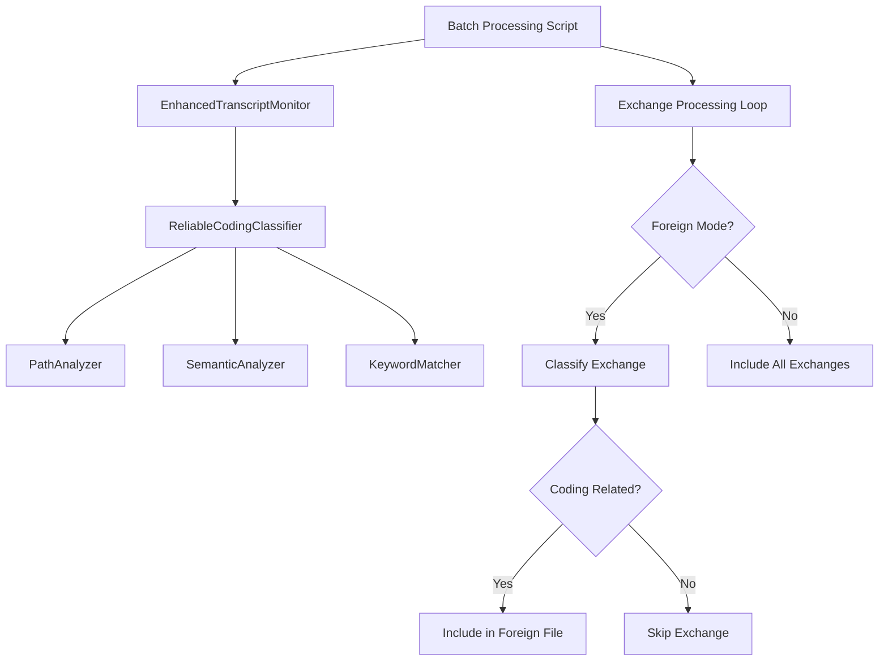

# Design Document

## Overview

This design addresses the critical flaw in the existing Live Session Logging (LSL) batch processing system where foreign mode generates files without proper content classification. The system currently shows 0 classification hits because the ReliableCodingClassifier is never invoked during exchange processing. This is a targeted fix to integrate the existing classification infrastructure with the batch processing pipeline.

## Steering Document Alignment

### Technical Standards (tech.md)
The design follows existing technical patterns in the codebase:
- Uses the existing ReliableCodingClassifier three-layer architecture (PathAnalyzer, SemanticAnalyzer, KeywordMatcher)
- Maintains compatibility with EnhancedTranscriptMonitor interfaces
- Preserves existing secret redaction and logging mechanisms

### Project Structure (structure.md)
Implementation will follow existing project organization:
- Batch processing remains in `scripts/generate-proper-lsl-from-transcripts.js`
- Classification components remain in `src/live-logging/`
- Logging output will be added to `.specstory/logs/`
- Foreign files continue to be written to coding project `.specstory/history/`

## Code Reuse Analysis

### Existing Components to Leverage
- **ReliableCodingClassifier**: Core classification engine with three-layer architecture - already initialized but not used
- **EnhancedTranscriptMonitor**: Contains classifier initialization logic - reuse without modification
- **Secret Redaction Functions**: Comprehensive API key/secret redaction - already working correctly
- **Time Window Processing**: Existing timezone-utils.js for session time boundaries
- **File Generation Logic**: Current session file creation and writing mechanisms

### Integration Points
- **Classification Pipeline**: Insert classifier calls into existing exchange processing loop
- **Environment Configuration**: Fix CODING_TARGET_PROJECT variable handling in existing getTargetProject()
- **Performance Tracking**: Extend existing stats reporting to show actual classification metrics
- **Error Handling**: Replace silent failures with explicit error throwing using existing patterns

## Architecture

The fix involves inserting classification calls into the existing batch processing pipeline without redesigning the overall architecture. The current system initializes the ReliableCodingClassifier but never calls it during exchange processing.

### Modular Design Principles
- **Single File Responsibility**: Keep classification logic in ReliableCodingClassifier, batch processing in generate-proper-lsl-from-transcripts.js
- **Component Isolation**: Use existing interfaces between EnhancedTranscriptMonitor and ReliableCodingClassifier
- **Service Layer Separation**: Maintain separation between transcript parsing, classification, and file generation
- **Utility Modularity**: Leverage existing timezone-utils, secret redaction utilities



## Components and Interfaces

### Enhanced Exchange Processing Loop
- **Purpose:** Add classification calls to existing exchange processing in foreign mode
- **Interfaces:** Uses existing monitor.reliableCodingClassifier.classify() method
- **Dependencies:** EnhancedTranscriptMonitor initialization, existing exchange parsing logic
- **Reuses:** Current exchange extraction, tool call parsing, time window processing

### Environment Configuration Fix
- **Purpose:** Ensure CODING_TARGET_PROJECT points to coding project for proper classification
- **Interfaces:** Existing getTargetProject() function
- **Dependencies:** Process environment variables, path resolution utilities
- **Reuses:** Current project detection and path configuration logic

### Classification Result Logging
- **Purpose:** Add debug logging for classification decisions and performance
- **Interfaces:** New logging functions integrated with existing operational logger
- **Dependencies:** Existing .specstory/logs directory structure
- **Reuses:** Current logging patterns and file organization

### Error Handling Enhancement
- **Purpose:** Replace silent failures with meaningful error messages
- **Interfaces:** Enhanced error throwing in classification failure scenarios
- **Dependencies:** Existing error handling patterns in the codebase
- **Reuses:** Current error formatting and console output mechanisms

## Data Models

### Classification Result
```javascript
{
  isCoding: boolean,           // Primary classification result
  confidence: number,          // Confidence score (0-1)
  layer: string,              // Which layer made the decision ('path', 'semantic', 'keyword')
  processingTime: number,      // Time taken in milliseconds
  debugInfo: object           // Additional classification details
}
```

### Exchange Processing Context
```javascript
{
  exchange: object,           // Parsed exchange with user message, assistant response, tool calls
  mode: string,              // Processing mode ('all', 'local', 'foreign')
  targetProject: object,     // Project configuration object
  isFromOtherProject: boolean // Whether this exchange originates from another project
}
```

### Enhanced Statistics
```javascript
{
  totalClassifications: number,     // Total classification calls made
  pathAnalysisHits: number,        // Classifications resolved by PathAnalyzer
  semanticAnalysisHits: number,    // Classifications resolved by SemanticAnalyzer  
  keywordAnalysisHits: number,     // Classifications resolved by KeywordMatcher
  avgClassificationTime: number,   // Average time per classification
  foreignInclusionRate: number     // Percentage of exchanges included in foreign files
}
```

## Error Handling

### Error Scenarios
1. **ReliableCodingClassifier Initialization Failure**
   - **Handling:** Throw descriptive error with initialization details, stop processing
   - **User Impact:** Clear error message indicating classification system unavailable

2. **Classification Call Failure**
   - **Handling:** Log specific exchange content and error details, throw error with context
   - **User Impact:** Information about which exchange caused classification to fail

3. **Environment Configuration Issues**
   - **Handling:** Validate CODING_TARGET_PROJECT early, throw error with correction guidance
   - **User Impact:** Actionable error message with correct environment variable setup

4. **Foreign File Creation Failure**
   - **Handling:** Provide specific path and permission error details
   - **User Impact:** Clear indication of file system or permission issues

## Testing Strategy

### Unit Testing
- Test classification integration with mock exchanges containing coding and non-coding content
- Verify environment variable configuration handling in different project contexts
- Test error handling for classification failures and invalid configurations

### Integration Testing
- Run foreign mode on real transcript data and verify classification statistics show >0 hits
- Test batch processing from both coding and non-coding projects with proper file routing
- Verify clean and incremental modes work correctly with classification filtering

### End-to-End Testing
- Process complete transcript sets and verify foreign files contain only coding-related exchanges
- Confirm classification performance metrics are accurately reported
- Test cross-project execution scenarios with proper environment configuration