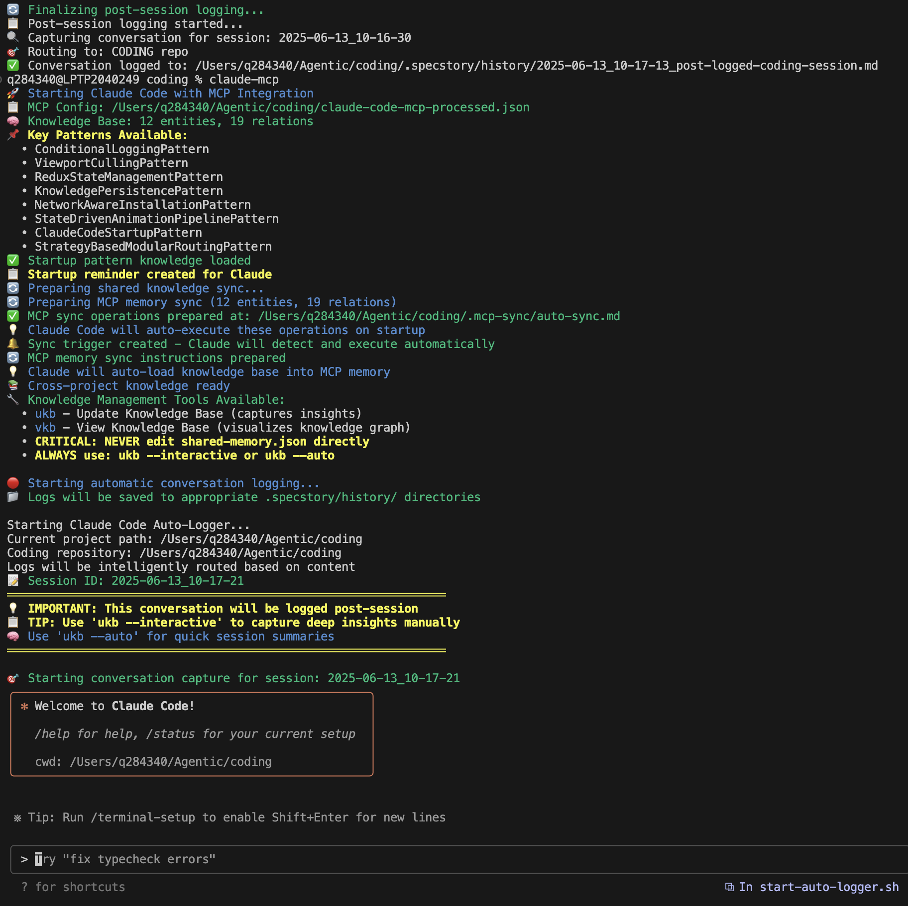

# Automatic Conversation Logging



## Overview

The Claude Code system includes **fully working** post-session automatic conversation logging that captures all interactions to `.specstory/history/` without any manual intervention. The system uses a robust Node.js post-processing script that analyzes completed Claude sessions to extract and save conversations, providing comprehensive logging with intelligent content routing.

**Status: ✅ FULLY OPERATIONAL** - Automatic conversation logging is working reliably across all Claude Code sessions.

## How It Works

### Architecture

1. **Automatic Trigger**: `claude-mcp` launcher automatically triggers post-session logging when Claude sessions end
2. **Post-Session Processing**: `post-session-logger.js` reliably processes Claude sessions after completion
3. **Session Data Analysis**: Robust analysis of session data to extract meaningful user/assistant exchanges  
4. **Post-Session Capture**: All conversations are captured and logged after Claude session termination
5. **Smart Content Routing**: Intelligent analysis determines routing to coding/.specstory/history/ vs current project
6. **Session Management**: Each session creates a properly timestamped log file in the appropriate repository
7. **Background Processing**: Silent background processing with no user intervention required

### Technical Implementation

```bash
# Post-session logging automatically triggered by claude-mcp launcher
# No manual intervention required - fully automated
claude-mcp  # Starts Claude and automatically handles post-session logging
```

### Implementation Details

#### Post-Session Logger (`post-session-logger.js`)
- **Robust processing** of completed Claude session data to extract conversations
- **Reliable analysis** of session transcripts for conversation boundaries using pattern matching (`Human:`, `Assistant:`, etc.)
- **Comprehensive extraction** of meaningful exchanges between user and assistant
- **Structured logging** creates properly formatted conversation logs from session data
- **Intelligent routing** to appropriate `.specstory/history/` directories based on content analysis
- **Error handling** ensures logging continues even with partial session data

#### Session Processing Logic
The post-session logger analyzes completed sessions with intelligent conversation parsing:

```javascript
// Key components of post-session-logger.js
function processSession(sessionData) {
  // Analyze session transcript for conversation boundaries
  const exchanges = extractExchanges(sessionData);
  
  // Detect conversation boundaries
  exchanges.forEach(exchange => {
    if (exchange.type === 'user') {
      // Process user input
      processUserMessage(exchange.content);
    } else if (exchange.type === 'assistant') {
      // Process assistant response
      processAssistantMessage(exchange.content);
    }
  });
  
  // Generate log file after processing all exchanges
  generateLogFile(exchanges);
}
```

#### Smart Content Detection
- **Coding Keywords**: ukb, vkb, shared-memory.json, MCP, knowledge management, etc.
- **Path Detection**: Matches coding repository paths and tool references
- **Cross-project Routing**: Ensures coding-related discussions go to coding/.specstory/history/
- **Dynamic Switching**: Can switch target repositories mid-conversation based on content

#### Legacy MCP Tools (Still Available)
- `claude-logger-mcp` **available for manual logging scenarios**:
  - Manual conversation recording when post-session processing isn't available
  - Debugging and testing logging functionality  
  - Session management tools (`start_session`, `end_session`, `list_sessions`)
  - Direct control over log formatting and metadata
- **Not used for automatic logging** - post-session processing is the primary method
- Tools: `enable_auto_logging`, `log_message`, `start_session`, `end_session`, `list_sessions`

### Configuration

Automatic logging is configured through the `claude-mcp` launcher script:

```bash
# claude-mcp script automatically triggers post-session logging
LOGGER_SCRIPT="$CODING_REPO_DIR/post-session-logger.js"
if [[ -f "$LOGGER_SCRIPT" ]]; then
    # Launch Claude and trigger post-session logging after completion
    claude --mcp-config "$MCP_CONFIG" "$@"
    # Post-session processing
    node "$LOGGER_SCRIPT" "$(pwd)" "$CODING_REPO_DIR"
else
    # Fallback to Claude without logging
    exec claude --mcp-config "$MCP_CONFIG" "$@"
fi
```

Environment variables:
- `CODING_REPO`: Path to the coding repository (defaults to `/Users/q284340/Agentic/coding`)
- Current working directory passed to determine project context

## File Structure

Conversation logs are stored in:
```
project-root/
└── .specstory/
    └── history/
        ├── 2025-06-10-Auto-logged Claude Code Session.md
        ├── 2025-06-11-Fixing ukb interactive mode.md
        └── ...
```

### Log File Format

Each log file contains:
- **Session metadata**: ID, start time, project path
- **Conversation exchanges**: Timestamped user prompts and assistant responses
- **Tool usage**: Tools invoked during the conversation
- **Model information**: Which Claude model was used

Example:
```markdown
# Auto-logged Claude Code Session

**Session ID:** 2025-06-11_08-15-30_claude-code  
**Started:** 2025-06-11T06:15:30.123Z  
**Project:** /Users/username/project

---

## User

*2025-06-11T06:15:35.456Z*

How do I implement a singleton pattern in TypeScript?

## Assistant

*2025-06-11T06:15:40.789Z*

Here's how to implement a singleton pattern in TypeScript...

<details>
<summary>Metadata</summary>

Model: claude-opus-4-20250514  
Tools Used: Read, Write
</details>
```

## Troubleshooting

### Logs Not Being Created

1. **Check Logger Script**: Ensure `post-session-logger.js` exists and is executable
2. **Verify Session Completion**: Check if Claude sessions are completing normally
3. **Permissions**: Ensure write permissions for `.specstory/history/` directory
4. **Session Data**: Verify that session data is available for post-processing

### Switching Between Manual and Auto Mode

To switch modes, update the logging configuration:

**For Auto Mode** (recommended):
```bash
# Ensure post-session-logger.js is in place
# The claude-mcp script will automatically trigger post-session logging
```

**For Manual Mode**:
```bash
# Use MCP logging tools directly
# Call logging functions manually during sessions
```

## Privacy and Security

- Logs are stored locally in your project directory
- No external transmission of conversation data
- Logs are excluded from git by default (check `.gitignore`)
- Sensitive information in conversations will be logged - review before sharing

## Integration with Knowledge Management

Logged conversations can be processed by the knowledge management system:

1. **Automatic Insight Extraction**: Future versions will analyze logs for patterns
2. **Session Summaries**: Generate summaries of long coding sessions
3. **Learning Capture**: Extract reusable solutions from problem-solving sessions
4. **Team Knowledge**: Share sanitized logs for team learning

## Future Enhancements

- [ ] Automatic insight extraction from conversation logs
- [ ] Session summarization tools
- [ ] Privacy filters for sensitive data
- [ ] Integration with `ukb` for automatic knowledge capture
- [ ] Search functionality across all conversation logs

---

*Note: The automatic logging feature ensures no valuable insights from Claude Code sessions are lost, creating a comprehensive record of your development journey.*