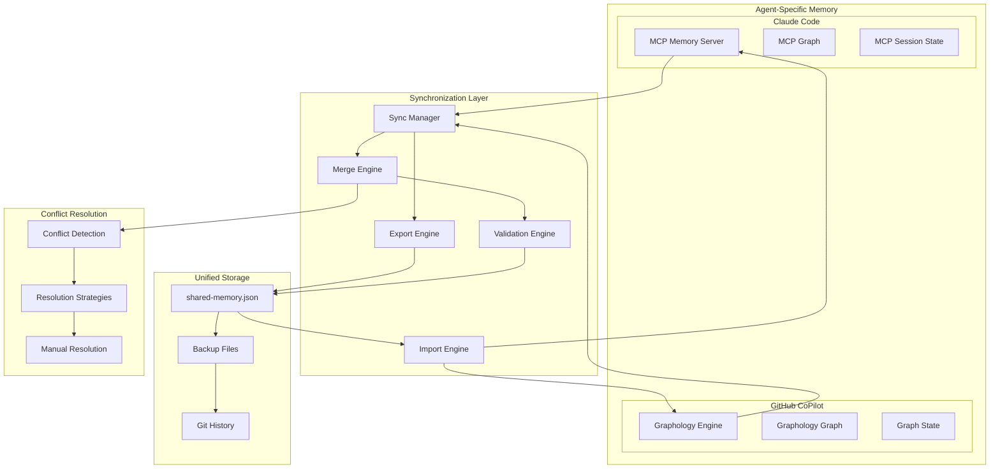
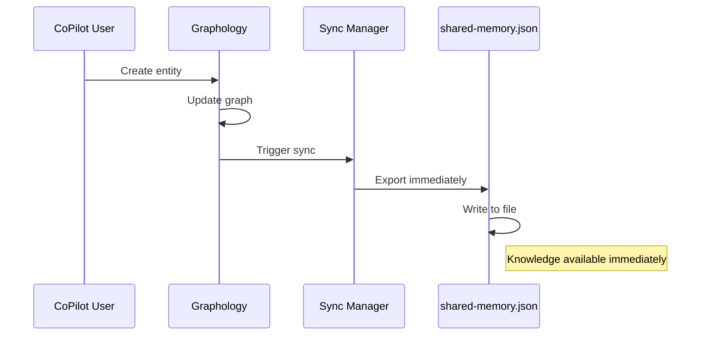
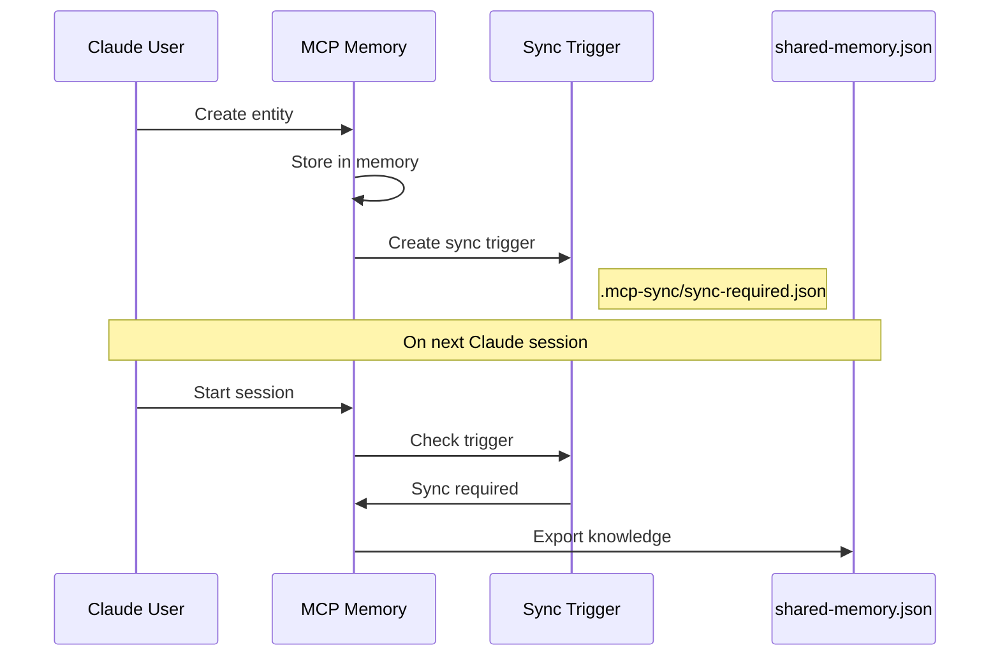
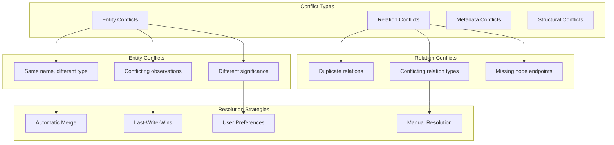
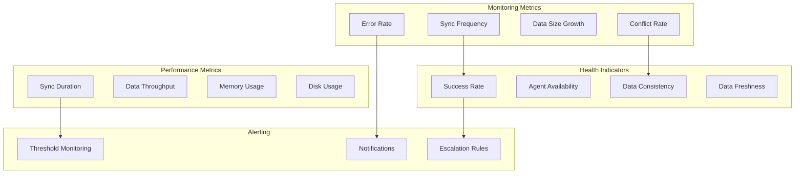

# Cross-Agent Memory Synchronization

This document describes how knowledge persists and synchronizes between different AI coding agents in the agent-agnostic coding tools system.

## Overview

The cross-agent memory synchronization system enables seamless knowledge sharing between Claude Code (MCP) and GitHub CoPilot (Graphology) users, ensuring that insights and patterns captured by one agent are available to all team members regardless of their preferred AI assistant.

## Architecture



## Memory Format Compatibility

### Unified Data Schema

Both MCP Memory Server and Graphology use a compatible data schema for seamless interoperability:

```typescript
interface Entity {
  name: string;
  entityType: string;
  observations: string[];
  significance?: number;
  created?: string;
  lastUpdated?: string;
  metadata?: Record<string, any>;
}

interface Relation {
  from: string;
  to: string;
  relationType: string;
  created?: string;
  metadata?: Record<string, any>;
}

interface KnowledgeGraph {
  entities: Entity[];
  relations: Relation[];
  metadata: {
    version: string;
    lastSync: string;
    source: 'mcp' | 'graphology' | 'manual';
    agentInfo: {
      agent: string;
      version: string;
      capabilities: string[];
    };
  };
}
```

### Format Converters

```javascript
class FormatConverter {
  // Convert MCP format to unified format
  fromMCPFormat(mcpData) {
    return {
      entities: mcpData.nodes?.map(node => ({
        name: node.name,
        entityType: node.entityType,
        observations: node.observations || [],
        significance: node.significance,
        created: node.created,
        lastUpdated: node.lastUpdated,
        metadata: node.metadata || {}
      })) || [],
      
      relations: mcpData.edges?.map(edge => ({
        from: edge.from,
        to: edge.to,
        relationType: edge.relationType,
        created: edge.created,
        metadata: edge.metadata || {}
      })) || [],
      
      metadata: {
        version: '2.0.0',
        lastSync: new Date().toISOString(),
        source: 'mcp',
        agentInfo: {
          agent: 'claude',
          version: mcpData.version || 'unknown',
          capabilities: ['mcp', 'memory', 'browser', 'logging']
        }
      }
    };
  }

  // Convert Graphology format to unified format
  fromGraphologyFormat(graphData) {
    return {
      entities: graphData.nodes?.map(node => ({
        name: node.name,
        entityType: node.entityType,
        observations: node.observations || [],
        significance: node.significance,
        created: node.created,
        lastUpdated: node.lastUpdated,
        metadata: node.metadata || {}
      })) || [],
      
      relations: graphData.edges?.map(edge => ({
        from: edge.from,
        to: edge.to,
        relationType: edge.relationType,
        created: edge.created,
        metadata: edge.metadata || {}
      })) || [],
      
      metadata: {
        version: '2.0.0',
        lastSync: new Date().toISOString(),
        source: 'graphology',
        agentInfo: {
          agent: 'copilot',
          version: graphData.version || 'unknown',
          capabilities: ['memory', 'browser', 'logging']
        }
      }
    };
  }
}
```

## Synchronization Strategies

### 1. **Immediate Sync** (Default for CoPilot)



### 2. **Session-Based Sync** (Default for Claude)



### 3. **Scheduled Sync** (Background Process)

```javascript
class ScheduledSyncManager {
  constructor(config) {
    this.interval = config.syncInterval || 300000; // 5 minutes
    this.running = false;
  }

  start() {
    if (this.running) return;
    
    this.running = true;
    this.intervalId = setInterval(async () => {
      try {
        await this.performSync();
      } catch (error) {
        console.error('Scheduled sync failed:', error);
      }
    }, this.interval);
  }

  async performSync() {
    const syncNeeded = await this.checkSyncNeeded();
    if (syncNeeded) {
      await this.synchronizeAll();
    }
  }

  async checkSyncNeeded() {
    // Check if any agent-specific storage is newer than shared storage
    const sharedStat = await fs.stat('shared-memory.json').catch(() => null);
    const mcpStat = await fs.stat('.mcp-sync/sync-required.json').catch(() => null);
    const graphStat = await fs.stat('.coding-tools/memory.json').catch(() => null);
    
    if (!sharedStat) return true;
    
    return (mcpStat && mcpStat.mtime > sharedStat.mtime) ||
           (graphStat && graphStat.mtime > sharedStat.mtime);
  }
}
```

## Conflict Resolution

### Conflict Types



### Conflict Resolution Engine

```javascript
class ConflictResolver {
  async resolveConflicts(localData, remoteData) {
    const conflicts = await this.detectConflicts(localData, remoteData);
    const resolutions = [];
    
    for (const conflict of conflicts) {
      const resolution = await this.resolveConflict(conflict);
      resolutions.push(resolution);
    }
    
    return this.applyResolutions(localData, remoteData, resolutions);
  }

  async resolveConflict(conflict) {
    switch (conflict.type) {
      case 'ENTITY_NAME_CONFLICT':
        return this.resolveEntityNameConflict(conflict);
      
      case 'OBSERVATION_CONFLICT':
        return this.resolveObservationConflict(conflict);
      
      case 'RELATION_CONFLICT':
        return this.resolveRelationConflict(conflict);
      
      default:
        return this.defaultResolution(conflict);
    }
  }

  resolveEntityNameConflict(conflict) {
    // Strategy: Merge entities with same name but different types
    const merged = {
      name: conflict.entity1.name,
      entityType: this.mergeEntityTypes(conflict.entity1.entityType, conflict.entity2.entityType),
      observations: [
        ...conflict.entity1.observations,
        ...conflict.entity2.observations
      ].filter((obs, index, arr) => arr.indexOf(obs) === index), // Remove duplicates
      significance: Math.max(conflict.entity1.significance || 0, conflict.entity2.significance || 0),
      created: this.earliestDate(conflict.entity1.created, conflict.entity2.created),
      lastUpdated: this.latestDate(conflict.entity1.lastUpdated, conflict.entity2.lastUpdated)
    };
    
    return {
      action: 'MERGE',
      result: merged
    };
  }

  resolveObservationConflict(conflict) {
    // Strategy: Combine observations, mark source
    const combinedObservations = [
      ...conflict.entity1.observations.map(obs => `[${conflict.source1}] ${obs}`),
      ...conflict.entity2.observations.map(obs => `[${conflict.source2}] ${obs}`)
    ];
    
    return {
      action: 'COMBINE',
      result: {
        ...conflict.entity1,
        observations: combinedObservations,
        lastUpdated: new Date().toISOString()
      }
    };
  }
}
```

### Manual Resolution Interface

```javascript
class ManualConflictResolver {
  async promptUserResolution(conflict) {
    const prompt = this.generateConflictPrompt(conflict);
    const resolution = await this.getUserInput(prompt);
    return this.parseResolution(resolution);
  }

  generateConflictPrompt(conflict) {
    return `
Conflict detected in entity: ${conflict.entityName}

Option 1 (${conflict.source1}):
  Type: ${conflict.entity1.entityType}
  Observations: ${conflict.entity1.observations.length}
  Last Updated: ${conflict.entity1.lastUpdated}

Option 2 (${conflict.source2}):
  Type: ${conflict.entity2.entityType}
  Observations: ${conflict.entity2.observations.length}
  Last Updated: ${conflict.entity2.lastUpdated}

Choose resolution:
1. Keep Option 1
2. Keep Option 2
3. Merge both
4. Manual edit

Enter choice (1-4):
    `;
  }
}
```

## Performance Optimization

### Incremental Synchronization

```javascript
class IncrementalSync {
  constructor() {
    this.lastSyncTimestamp = null;
    this.changeTracker = new ChangeTracker();
  }

  async performIncrementalSync() {
    const changes = await this.changeTracker.getChangesSince(this.lastSyncTimestamp);
    
    if (changes.length === 0) {
      return { status: 'NO_CHANGES' };
    }

    const syncResult = await this.applySyncChanges(changes);
    this.lastSyncTimestamp = new Date().toISOString();
    
    return syncResult;
  }

  async applySyncChanges(changes) {
    const batches = this.batchChanges(changes);
    const results = [];

    for (const batch of batches) {
      const result = await this.processBatch(batch);
      results.push(result);
    }

    return this.consolidateResults(results);
  }
}
```

### Compression and Caching

```javascript
class SyncOptimizer {
  async compressData(data) {
    // Remove redundant information
    const compressed = {
      entities: data.entities.map(entity => ({
        n: entity.name,
        t: entity.entityType,
        o: entity.observations,
        s: entity.significance,
        c: entity.created,
        u: entity.lastUpdated
      })),
      relations: data.relations.map(rel => ({
        f: rel.from,
        t: rel.to,
        r: rel.relationType
      })),
      m: data.metadata
    };
    
    return JSON.stringify(compressed);
  }

  async decompressData(compressedData) {
    const compressed = JSON.parse(compressedData);
    
    return {
      entities: compressed.entities.map(entity => ({
        name: entity.n,
        entityType: entity.t,
        observations: entity.o,
        significance: entity.s,
        created: entity.c,
        lastUpdated: entity.u
      })),
      relations: compressed.relations.map(rel => ({
        from: rel.f,
        to: rel.t,
        relationType: rel.r
      })),
      metadata: compressed.m
    };
  }
}
```

## Monitoring and Metrics

### Sync Health Monitoring



### Metrics Collection

```javascript
class SyncMetrics {
  constructor() {
    this.metrics = {
      syncCount: 0,
      conflictCount: 0,
      errorCount: 0,
      totalSyncTime: 0,
      dataSize: 0,
      lastSync: null
    };
  }

  recordSync(duration, dataSize, conflicts = 0) {
    this.metrics.syncCount++;
    this.metrics.totalSyncTime += duration;
    this.metrics.dataSize = dataSize;
    this.metrics.conflictCount += conflicts;
    this.metrics.lastSync = new Date().toISOString();
  }

  recordError(error) {
    this.metrics.errorCount++;
    console.error('Sync error:', error);
  }

  getHealthReport() {
    const avgSyncTime = this.metrics.totalSyncTime / this.metrics.syncCount;
    const successRate = (this.metrics.syncCount - this.metrics.errorCount) / this.metrics.syncCount;
    
    return {
      health: this.calculateHealthScore(successRate, avgSyncTime),
      metrics: {
        ...this.metrics,
        avgSyncTime,
        successRate,
        conflictRate: this.metrics.conflictCount / this.metrics.syncCount
      }
    };
  }
}
```

## Security Considerations

### Data Validation

```javascript
class SyncValidator {
  validate(data) {
    const errors = [];
    
    // Validate entities
    for (const entity of data.entities) {
      if (!this.isValidEntity(entity)) {
        errors.push(`Invalid entity: ${entity.name}`);
      }
    }
    
    // Validate relations
    for (const relation of data.relations) {
      if (!this.isValidRelation(relation, data.entities)) {
        errors.push(`Invalid relation: ${relation.from} -> ${relation.to}`);
      }
    }
    
    return {
      valid: errors.length === 0,
      errors
    };
  }

  isValidEntity(entity) {
    return entity.name && 
           entity.entityType && 
           Array.isArray(entity.observations) &&
           this.isSafeString(entity.name) &&
           this.isSafeString(entity.entityType);
  }

  isSafeString(str) {
    // Prevent injection attacks
    const dangerousPatterns = [/<script/i, /javascript:/i, /on\w+=/i];
    return !dangerousPatterns.some(pattern => pattern.test(str));
  }
}
```

### Access Control

```javascript
class SyncAccessControl {
  constructor(config) {
    this.permissions = config.permissions || {};
    this.encryption = config.encryption;
  }

  async authorize(operation, agent, data) {
    const permission = this.permissions[agent]?.[operation];
    
    if (!permission) {
      throw new Error(`Agent ${agent} not authorized for ${operation}`);
    }
    
    // Additional validation based on data content
    if (operation === 'WRITE' && this.containsSensitiveData(data)) {
      return this.requireAdditionalAuth(agent);
    }
    
    return true;
  }

  containsSensitiveData(data) {
    const sensitivePatterns = [
      /password/i, /secret/i, /token/i, /key/i,
      /\b\d{4}[-\s]?\d{4}[-\s]?\d{4}[-\s]?\d{4}\b/, // Credit card
      /\b\d{3}-\d{2}-\d{4}\b/ // SSN
    ];
    
    const content = JSON.stringify(data);
    return sensitivePatterns.some(pattern => pattern.test(content));
  }
}
```

This cross-agent memory synchronization system ensures that knowledge flows seamlessly between different AI coding agents while maintaining data integrity, resolving conflicts intelligently, and providing robust monitoring and security features.