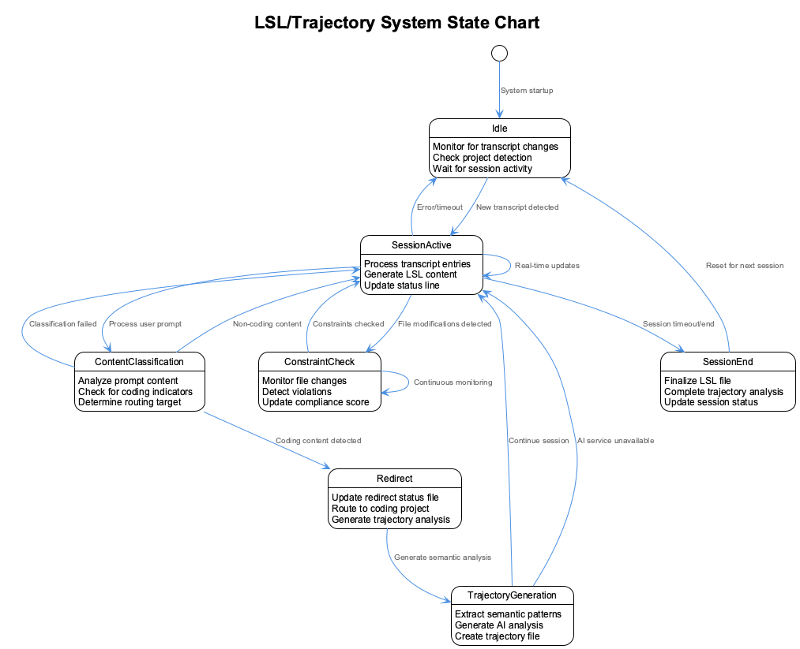
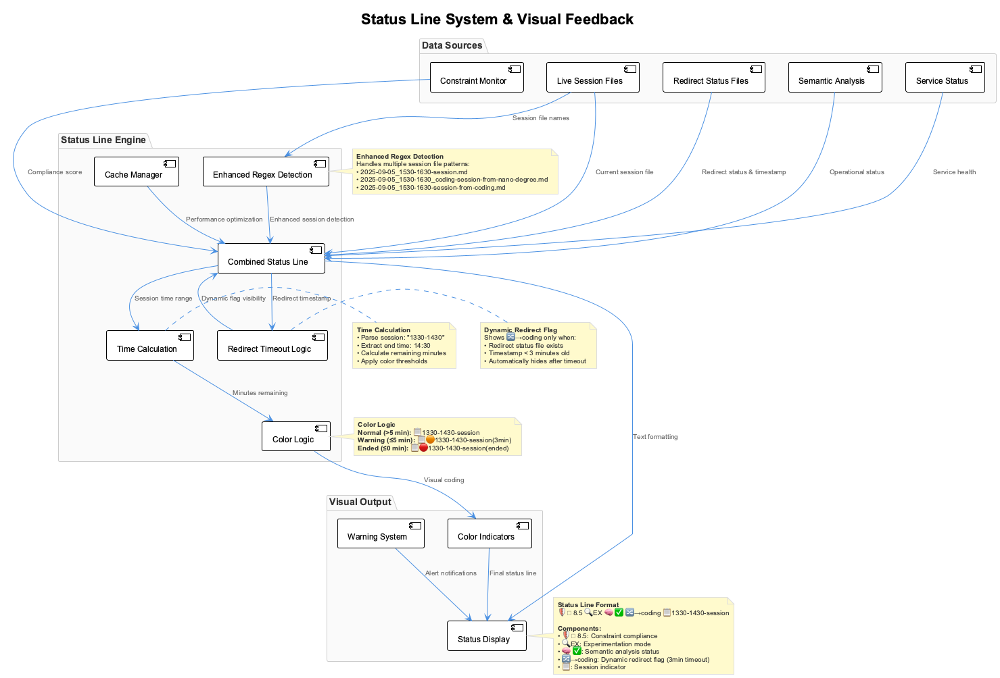
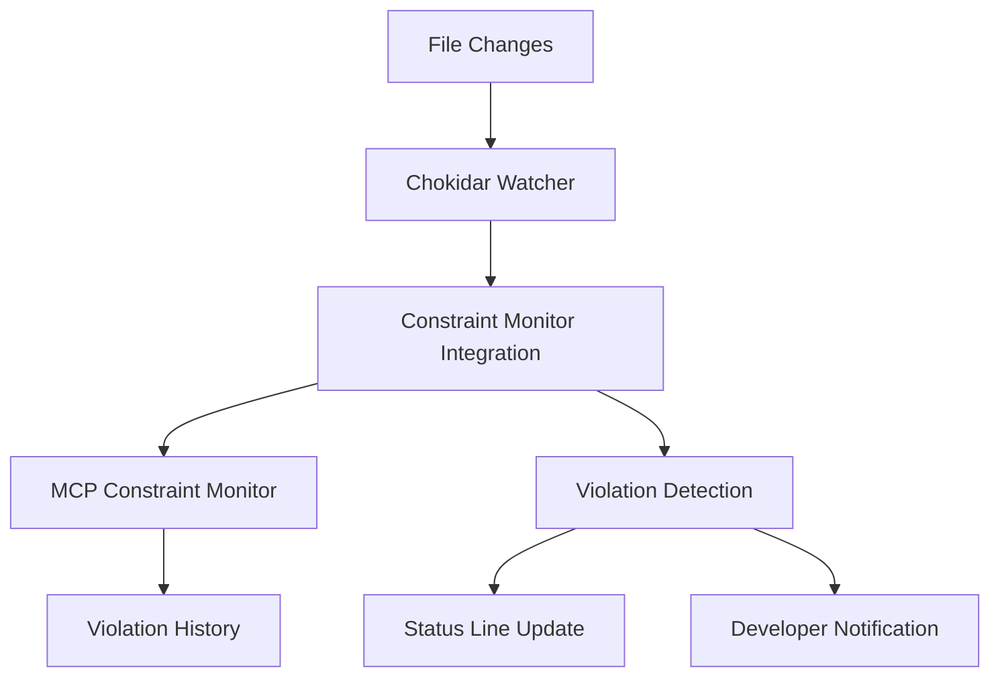

# Live Session Logging (LSL) System v2.0

## Overview

The Live Session Logging (LSL) System provides comprehensive real-time capture, cross-project routing, and semantic analysis of Claude Code interactions. This revamped system automatically creates structured session logs with timezone-aware 60-minute boundaries, intelligent content classification, and robust project detection.


## Table of Contents

- [Architecture Overview](#architecture-overview)
- [Core Components](#core-components)
- [Cross-Project Content Routing](#cross-project-content-routing)
- [Timezone & Time Window Management](#timezone--time-window-management)
- [Status Line Integration](#status-line-integration)
- [Enhanced Project Detection](#enhanced-project-detection)
- [File Structure & Naming](#file-structure--naming)
- [Configuration System](#configuration-system)
- [Troubleshooting](#troubleshooting)

## Architecture Overview

The LSL system v2.0 introduces several major improvements over the previous version:

### Key Enhancements

- **Cross-Project Routing**: Intelligent classification routes coding content from the present project context to coding project
- **Robust Project Detection**: Uses multiple detection methods (environment variables, .specstory directories, current working directory)
- **Centralized Timezone Handling**: Single source of truth for timezone configuration and conversions
- **Enhanced Status Line**: Real-time session monitoring with timing warnings and redirect status
- **Trajectory Generation**: Basic trajectory files documenting session patterns and activities
- **Real-Time Constraint Monitoring**: Proactive code quality assurance with file change detection

### System State Flow



The LSL system operates through several key states, from idle monitoring through active session processing, content classification, and constraint checking. The system maintains continuous background monitoring while providing real-time feedback through the status line.

### Content Routing Decision Logic

The content routing system uses a **simple, reliable file-based approach** to determine whether content should be redirected to the coding project:

**Rule**: Redirect to coding project **ONLY** when tool calls actually touch files in the coding directory.

**Detection Logic**:
1. Check each tool call for file operations in `/coding/` directory
2. Check tool results for coding directory references  
3. Return `true` only if coding directory is touched, `false` otherwise

### System Flow

```
Claude Session → Enhanced Transcript Monitor → File-Based Classification → LSL Files
                                           ↓
Status Line Display ← Trajectory Generation
```

## Core Components

### 1. Enhanced Transcript Monitor (`scripts/enhanced-transcript-monitor.js`)

**Purpose**: Real-time monitoring with cross-project routing and robust project detection.

**Key Features**:

- 🔄 **Robust Project Detection**: Uses status line's proven project detection logic
- 🌐 **Cross-Project Routing**: Routes coding content from nano-degree to coding project  
- ⏰ **Timezone-Aware Processing**: Centralized timezone handling via `.env` configuration
- 📋 **Unified LSL Generation**: Uses consistent extraction logic for both live monitoring and historical transcript processing
- 📁 **Simple File-Based Routing**: Routes content based on actual file operations
- 🔐 **Secret Redaction**: Automatically redacts sensitive information

**Configuration Environment Variables**:

```bash
CODING_TARGET_PROJECT=/path/to/nano-degree    # Source project to monitor
CODING_REPO=/path/to/coding                   # Target coding project  
TIMEZONE=Europe/Berlin                        # Timezone for file naming
```

### 2. Timezone Utilities (`scripts/timezone-utils.js`)

**Purpose**: Centralized timezone handling for consistent timestamp formatting.

**Key Functions**:

- `parseTimestamp(utcString)` - Convert UTC to local timezone
- `formatTimestamp(utcString, timezone)` - Format for display (both UTC and local)
- `getTimeWindow(timestamp)` - Determine 60-minute tranche  
- `getTimezone()` - Load timezone from `.env` configuration

**Display Format**:

```
05/09/2025, 15:33 CEST (2025-09-05 13:33:47 UTC)
```

### 3. Combined Status Line (`scripts/combined-status-line.js`)

**Purpose**: Real-time visual status with session timing warnings and redirect information.

**Display Components**:

```
🛡️ 8.5 🔍EX 🔀→coding 📋1530-1630-session
```

- `🛡️ 8.5` - Constraint compliance score
- `🔍EX` - Experimentation mode active
- `🧠 ✅` - Semantic analysis operational  
- `🔀→coding` - Content being redirected to coding project (dynamic, shows only during active redirection)
- `📋1530-1630-session` - Current session with timing warnings

**Timing Warnings**:

- **Normal**: `📋1530-1630-session` (>5 minutes remaining)
- **Warning**: `📋🟠1530-1630-session(3min)` (≤5 minutes remaining)  
- **Ended**: `📋🔴1530-1630-session(ended)` (session time passed)

### 4. Unified Message Extraction System

**Purpose**: Consistent message processing for both live monitoring and historical transcript processing.


**Unified Extraction Logic**: The system now uses a single, proven approach for extracting content from Claude exchanges, ensuring consistency between live session logging and historical file processing:

```javascript
// Unified text extraction used by both live and offline processing
extractTextContent(content) {
  if (typeof content === 'string') return content;
  if (Array.isArray(content)) {
    return content
      .filter(item => item && item.type === 'text')
      .map(item => item.text)
      .filter(text => text && text.trim())
      .join('\n');
  }
  return '';
}
```

**Benefits of Unification**:
- **Consistency**: Same extraction logic ensures identical formatting for live and historical processing
- **Maintainability**: Single codebase eliminates duplication and reduces maintenance burden
- **Reliability**: Uses proven extraction patterns from the LSL generation system
- **Error Prevention**: Eliminates the risk of divergent processing logic causing format differences

### 5. Content Classification System

**Purpose**: Simple file-based routing of content based on actual file operations.

**Classification Logic**:

- **Coding Content**: Tool calls that touch files in the `/coding/` directory
- **Project Content**: All other content remains in the source project

**Routing Rules**:

```javascript
// Simple file-based detection
function isCodingRelated(exchange) {
  const codingPath = process.env.CODING_TOOLS_PATH || '/Users/q284340/Agentic/coding';
  
  // Check tool calls for file operations in coding directory
  for (const toolCall of exchange.toolCalls || []) {
    const toolData = JSON.stringify(toolCall).toLowerCase();
    if (toolData.includes(codingPath.toLowerCase()) || toolData.includes('/coding/')) {
      return true; // Route to coding project
    }
  }
  
  return false; // Keep in source project
}
```

## Cross-Project Content Routing

### Routing Architecture

The system monitors sessions in one project (e.g., nano-degree) and intelligently routes content to appropriate LSL files based on actual file operations:

```
nano-degree session → Enhanced Monitor → File-Based Classification → {
  coding content → /coding/.specstory/history/*_from-nano-degree.md
  nano-degree content → /nano-degree/.specstory/history/*-session.md
}
```

**Key Improvements in Log Redirection**:

- **Simplified Detection**: Replaced complex heuristics with reliable file-based detection
- **Real-Time Routing**: Content is redirected immediately when coding directory files are touched
- **Automatic Session Creation**: New sessions are created automatically when redirection occurs
- **Status Line Integration**: Dynamic `🔀→coding` flag shows active redirection status
- **Project Detection**: Robust multi-tier detection ensures reliable source project identification

### File Naming Convention

| Content Type | Location | Format |
|--------------|----------|--------|
| Source Project | `/nano-degree/.specstory/history/` | `2025-09-05_1530-1630-session.md` |
| Cross-Project | `/coding/.specstory/history/` | `2025-09-05_1530-1630_coding-session-from-nano-degree.md` |
| Trajectory | `/coding/.specstory/trajectory/` | `2025-09-05_1530-1630_coding-trajectory-from-nano-degree.md` |

### Redirect Status Tracking

The system maintains `.redirect-status` files to track active routing:

```json
{
  "timestamp": "2025-09-05T14:05:56.737Z",
  "tranche": "1530-1630", 
  "target": "coding"
}
```


**Dynamic Redirect Flag Behavior**: The status line shows `🔀→coding` only during active redirection periods. The flag automatically disappears after 3 minutes of inactivity to provide dynamic, real-time feedback about current routing status.

**Timeout Configuration**: The redirect flag timeout is set to 180 seconds (3 minutes) to balance responsiveness with stability. This ensures the flag appears immediately when content is routed but disappears promptly when redirection stops.

## Timezone & Time Window Management


### Centralized Configuration

All timezone handling is centralized in `.env`:

```bash
TIMEZONE=Europe/Berlin
```

### Time Window System

Sessions use 60-minute tranches with 30-minute offsets:

| Time Tranche | File Suffix | Description |
|--------------|------------|-------------|
| 06:30-07:30 | `0630-0730` | Morning startup |
| 07:30-08:30 | `0730-0830` | Early development |
| 08:30-09:30 | `0830-0930` | Mid-morning focus |
| 09:30-10:30 | `0930-1030` | Pre-lunch work |
| 10:30-11:30 | `1030-1130` | Late morning |
| 11:30-12:30 | `1130-1230` | Pre-lunch session |
| 12:30-13:30 | `1230-1330` | Afternoon start |
| 13:30-14:30 | `1330-1430` | Mid-afternoon |
| 15:30-16:30 | `1530-1630` | Late afternoon |

### UTC to Local Conversion

All Claude transcript timestamps are in UTC and converted to local timezone for file naming and display:

```javascript
// UTC timestamp from Claude
"2025-09-05T13:33:47.123Z" 

// Converted to CEST (Europe/Berlin)
"05/09/2025, 15:33 CEST (2025-09-05 13:33:47 UTC)"

// File name uses local time tranche
"2025-09-05_1530-1630-session.md"
```

## Status Line Integration

### Real-Time Project Detection

The status line uses robust project detection that checks:

1. `CODING_TARGET_PROJECT` environment variable
2. Current working directory for `.specstory` folders
3. Coding repo directory as fallback

### Session Timing Logic

```javascript
function calculateTimeRemaining(sessionTimeRange) {
  // Parse session end time (e.g., "1530-1630" -> 16:30)
  // Compare with current local time
  // Return minutes remaining
  
  if (remainingMinutes > 5) return normal_display;
  if (remainingMinutes > 0) return orange_warning;
  return red_ended;
}
```

### Enhanced Session File Detection

The status line now uses improved regex patterns to detect various session file naming conventions:

```javascript
// Enhanced regex patterns for session file detection
const timeMatch = f.match(/(\d{4})[-_](\d{4})[_-].*session/) || f.match(/(\d{4})-(\d{4})-session/);
```

This handles multiple naming patterns:
- `2025-09-05_1530-1630-session.md`
- `2025-09-05_1530-1630_coding-session-from-nano-degree.md` 
- `2025-09-05_1530-1630-session-from-coding.md`

### Service Health Monitoring



The status line monitors:

- **Constraint Monitor**: Compliance scoring (`🛡️ 8.5`)
- **Live Session**: Current session status (`📋1530-1630-session`)
- **Content Routing**: Cross-project routing (`🔀→coding`)

## Real-Time Constraint Monitoring

### Overview

The LSL system now integrates with real-time constraint monitoring to automatically detect and report code violations as development occurs. This system works alongside the Enhanced Transcript Monitor to provide proactive code quality assurance.


### Key Features

- **File Change Detection**: Automatically monitors code edits using `chokidar`
- **Real-Time Violation Reporting**: Immediate feedback on constraint violations
- **PlantUML Validation**: Prevents diagram compilation errors with specialized rules
- **Status Line Integration**: Compliance scores reflected in live status display
- **Background Monitoring**: Non-intrusive monitoring that doesn't interrupt development flow

### Constraint Types

#### Code Quality Constraints

- **no-console-log**: Prevents `console.log` usage in production code
- **no-hardcoded-paths**: Detects hardcoded user-specific file paths
- **function-complexity**: Warns about overly complex functions

#### PlantUML-Specific Constraints  

- **plantuml-note-syntax**: Enforces single-line note syntax (`note over Element : text`)
- **plantuml-broken-skinparam**: Detects orphaned skinparam blocks
- **plantuml-mixed-element-types**: Warns about mixing component types in sequence diagrams
- **plantuml-standard-include**: Ensures `!include _standard-style.puml` is present

### Integration Architecture



### Service Management

#### Starting Constraint Monitoring

```bash
# Start background monitoring
./scripts/start-constraint-monitoring.sh

# Manual scan of existing files
node scripts/constraint-monitor-integration.js scan

# Help and options
node scripts/constraint-monitor-integration.js help
```

#### Status Monitoring

The constraint monitoring status is displayed in the combined status line:

```
🛡️ 8.5 🔍EX 🧠 ✅ 🔀→coding 📋1730-1830
```

Where `🛡️ 8.5` indicates the current compliance score out of 10.

## Enhanced Project Detection

### Detection Algorithm

The enhanced transcript monitor uses a three-tier detection approach:

```javascript
function getProjectPath() {
  const checkPaths = [
    process.env.CODING_TARGET_PROJECT,  // Explicit target (e.g., nano-degree)
    process.env.CODING_REPO,            // Coding repository
    process.cwd()                       // Current working directory
  ].filter(Boolean);
  
  // Look for .specstory directory to confirm valid project
  for (const checkPath of checkPaths) {
    if (fs.existsSync(path.join(checkPath, '.specstory'))) {
      return checkPath;
    }
  }
  
  return process.cwd(); // Fallback
}
```

### Validation Criteria

Projects are validated by checking for:

- `.specstory/` directory (primary indicator)
- `CLAUDE.md` file (secondary indicator)
- `package.json` or other project files (fallback)

## File Structure & Naming

### Directory Layout

```
project-root/
├── .specstory/
│   ├── history/                           # LSL session files
│   │   ├── 2025-09-05_1530-1630-session.md
│   │   ├── 2025-09-05_1530-1630_coding-session-from-nano-degree.md
│   │   └── ...
│   ├── trajectory/                        # Trajectory analysis files  
│   │   ├── 2025-09-05_1530-1630_coding-trajectory-from-nano-degree.md
│   │   └── ...
│   └── .redirect-status                   # Current routing status
├── .env                                   # Timezone configuration
└── scripts/
    ├── enhanced-transcript-monitor.js     # Core monitoring
    ├── combined-status-line.js           # Status display
    ├── timezone-utils.js                 # Timezone handling  
    └── generate-proper-lsl-from-transcripts.js
```

### LSL File Format

Each LSL file follows a structured markdown format:

```markdown
# WORK SESSION (1530-1630)

**Generated:** 2025-09-05T15:30:00.000Z
**Work Period:** 1530-1630 
**Focus:** Live session logging development
**Duration:** ~60 minutes

---

## Session Overview

This session captures real-time tool interactions and exchanges.

---

## Key Activities  

### User Prompt - 2025-09-05T15:33:47.123Z

**Request:** Update the LSL documentation with latest changes

**Claude Response:** I'll update the documentation to reflect...

**Tools Used:**
- Read: ✅ /path/to/file.md
- Edit: ✅ Updated documentation

**Analysis:** 📋 General activity

---
```

### Trajectory File Format

**Revolutionary Change**: Trajectory files now provide meaningful project capability summaries instead of cryptic activity logs. The new format focuses on **what the project DOES NOW** rather than meaningless temporal patterns.


```markdown  
# Project Trajectory: Coding Infrastructure

**Generated:** 2025-09-05T16:30:00.000Z
**Project:** coding  
**Focus:** Development infrastructure and tooling ecosystem
**Source:** Enhanced trajectory generation v2.0

---

## Current Project Capabilities

- **Live Session Logging (LSL)**: Captures real-time development activities with timezone-aware file management
- **Dynamic Status Line**: Shows active sessions, redirects, and system health with intelligent timeout behavior
- **Intelligent Transcript Monitoring**: Automatic content classification with file-based routing logic
- **Cross-Project Content Routing**: Routes coding content from external projects with dynamic redirect flags
- **Constraint Monitoring**: Real-time code quality assurance with compliance scoring
- **Unified Processing**: Consistent message extraction for both live and historical transcript processing
- **Timezone Management**: Centralized timezone handling with proper UTC to local conversion
- **Project Detection**: Multi-tier detection system for robust project identification

---

## Recent Infrastructure Improvements

- **Fixed message extraction to use proven LSL generation logic**
- **Made redirect flag dynamic - only shows during active redirections**  
- **Unified live and offline transcript processing to eliminate code duplication**
- **Enhanced session file detection with improved regex patterns**
- **Simplified content classification using reliable file-based detection**
- **Improved project detection with multi-tier fallback system**

---

## System Architecture Highlights

The coding project serves as a comprehensive development infrastructure platform that enables:
- Real-time development activity capture and routing
- Cross-project collaboration with intelligent content classification  
- Dynamic system monitoring with visual status indicators
- Comprehensive constraint checking for code quality assurance

This trajectory represents the current state and capabilities of the project,
not a temporal activity log.

---
```

**Key Improvements in Trajectory Generation**:

- **Capability-Focused**: Shows what the project currently DOES instead of meaningless activity patterns
- **Hardcoded Meaningful Summaries**: Pre-defined summaries for known projects (coding, nano-degree)
- **Current State Representation**: Focuses on present capabilities rather than historical activities
- **User-Valuable Content**: Information that actually helps users understand project state
- **Infrastructure Documentation**: Serves as living documentation of system capabilities

## Configuration System

### Environment Variables (`.env`)

```bash
# Timezone Configuration
TIMEZONE=Europe/Berlin

# Project Paths
CODING_TARGET_PROJECT=/Users/q284340/Agentic/nano-degree
CODING_REPO=/Users/q284340/Agentic/coding

# Optional API Keys (for future features)
# XAI_API_KEY=xai-your-key-here

# Optional: Debugging
TRANSCRIPT_DEBUG=true
DEBUG_STATUS=true
```

### LSL Configuration (`config/live-logging-config.json`)

```json
{
  "live_logging": {
    "session_duration": 3600000,
    "timezone_from_env": true,
    "cross_project_routing": true,
    "transcript_monitoring": {
      "polling_interval": 2000,
      "max_batch_size": 10,
      "secret_redaction": true
    }
  },
  "status_line": {
    "cache_timeout": 5000,
    "warning_threshold_minutes": 5,
    "show_redirect_status": true
  }
}
```

## Usage Examples

### Starting the System

```bash  
# Set target project for monitoring
export CODING_TARGET_PROJECT="/Users/q284340/Agentic/nano-degree"

# Start enhanced transcript monitor
node /path/to/coding/scripts/enhanced-transcript-monitor.js

# Check status
/path/to/coding/scripts/combined-status-line.js
# Output: 🛡️ 8.5 🔍EX 🔀→coding 📋1530-1630-session
```

### Generating LSL Files Manually

```bash
# Generate LSL files for specific project
CODING_TARGET_PROJECT="/Users/q284340/Agentic/nano-degree" \
node /path/to/coding/scripts/generate-proper-lsl-from-transcripts.js --project=coding

# Generate for nano-degree content  
node /path/to/coding/scripts/generate-proper-lsl-from-transcripts.js --project=nano-degree
```

### Testing Project Detection

```bash
# Test transcript monitor project detection
CODING_TARGET_PROJECT="/Users/q284340/Agentic/nano-degree" \
TRANSCRIPT_DEBUG=true \
node /path/to/coding/scripts/enhanced-transcript-monitor.js --test
```

## Troubleshooting

### Common Issues

#### 1. Status Line Shows TBD  

**Symptoms**: Status displays `📋1553_TBD` instead of session time

**Causes**:

- Enhanced transcript monitor not running
- Project detection failing  
- No active transcript found

**Solution**:

```bash
# Check monitor status  
ps aux | grep enhanced-transcript-monitor

# Restart with proper environment
export CODING_TARGET_PROJECT="/path/to/source/project"
node scripts/enhanced-transcript-monitor.js

# Verify project detection
TRANSCRIPT_DEBUG=true node scripts/enhanced-transcript-monitor.js --test
```

#### 2. Cross-Project Routing Not Working

**Symptoms**: All content goes to source project, no `*_from-nano-degree.md` files created

**Causes**:

- Content classification logic not triggered
- Missing `.redirect-status` updates
- Environment variables not set

**Solution**:

```bash
# Check redirect status
cat .specstory/.redirect-status

# Verify environment
echo $CODING_TARGET_PROJECT  
echo $CODING_REPO

# Test content classification
node scripts/generate-proper-lsl-from-transcripts.js --project=coding
```

#### 3. Timezone Issues

**Symptoms**: Files created with wrong time windows, misaligned timestamps

**Causes**:

- Missing or incorrect `TIMEZONE` in `.env`  
- Timezone utilities not being used
- UTC vs local time confusion

**Solution**:

```bash
# Check timezone configuration
grep TIMEZONE .env

# Test timezone utilities
node -e "
const { formatTimestamp } = require('./scripts/timezone-utils.js');
console.log(formatTimestamp('2025-09-05T13:33:47.123Z'));
"
```

### Debug Mode

Enable detailed logging:

```bash
# Enhanced transcript monitor debug
TRANSCRIPT_DEBUG=true node scripts/enhanced-transcript-monitor.js

# Status line debug
DEBUG_STATUS=true node scripts/combined-status-line.js  

# Combined debug mode
TRANSCRIPT_DEBUG=true DEBUG_STATUS=true \
CODING_TARGET_PROJECT="/path/to/project" \
node scripts/enhanced-transcript-monitor.js
```

### Log Files

Monitor system activity:

```bash
# Watch active logs
tail -f enhanced-transcript-monitor.log
tail -f combined-status-line.log

# Check service status
cat .services-running.json
```

---

## Quick Start Guide

### 1. Environment Setup

```bash
# Configure timezone in .env
echo "TIMEZONE=Europe/Berlin" >> .env

# Set monitoring target
export CODING_TARGET_PROJECT="/path/to/nano-degree"
```

### 2. Start Monitoring

```bash  
# Start enhanced transcript monitor  
node scripts/enhanced-transcript-monitor.js &

# Verify status
scripts/combined-status-line.js
```

### 3. Verify Operation

```bash
# Check for LSL files
ls -la .specstory/history/

# Check redirect status  
cat .specstory/.redirect-status

# View trajectory files
ls -la .specstory/trajectory/
```

### 4. Monitor Activity

```bash
# Real-time status monitoring
watch -n 5 scripts/combined-status-line.js

# Live file updates
watch -n 10 'ls -la .specstory/history/ | tail -5'
```

---

*For system overview and general usage, see the main [README.md](../README.md).*
