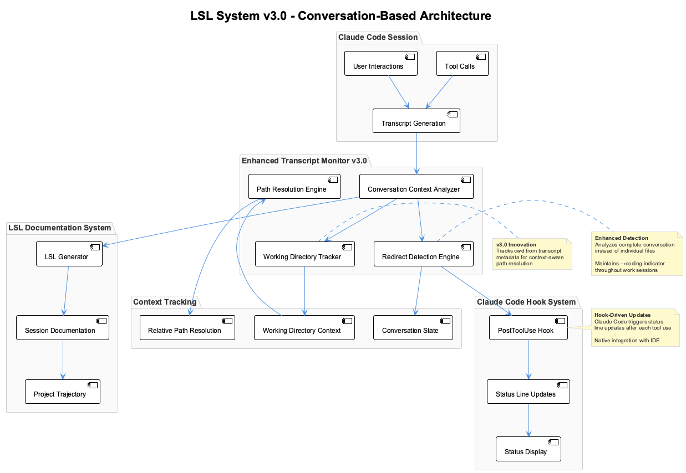
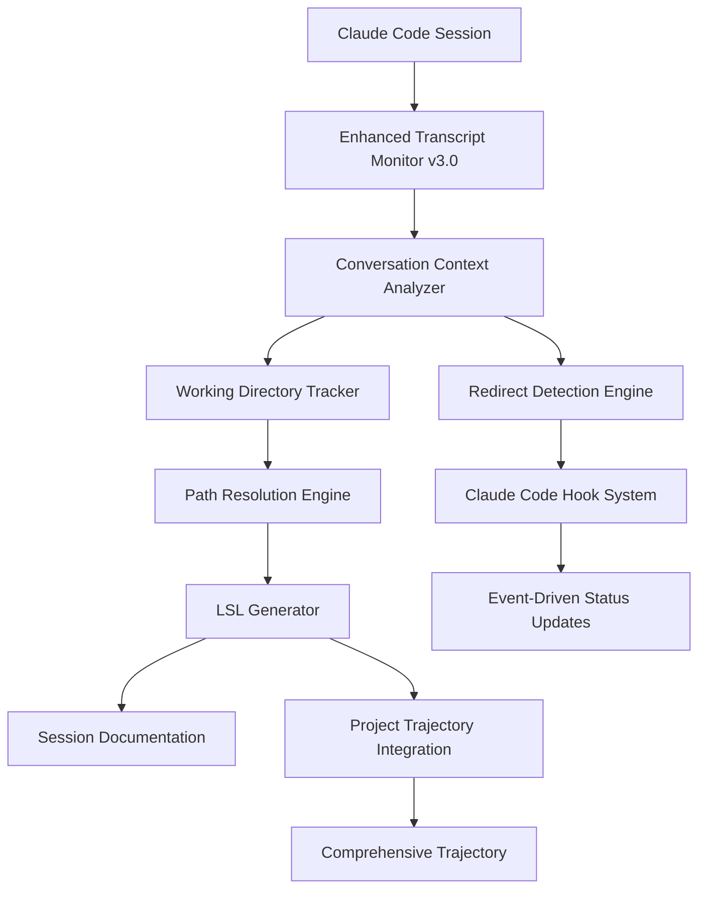
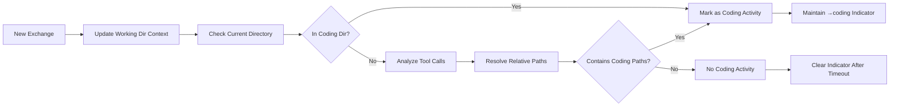

# Live Session Logging System v3.0

**Status**: ✅ Active Production System  
**Last Updated**: 2025-09-07  
**Next Review**: Weekly during active development  
**Version**: 3.0  
**Compatibility**: Claude Code v1.0+

---

## Overview

The Live Session Logging (LSL) system automatically generates comprehensive documentation of Claude Code work sessions in real-time. Version 3.0 introduces **conversation-based redirect detection** with **working directory context tracking**, enabling precise detection of coding activities regardless of relative or absolute file paths, integrated with Claude Code's native hook system.



> **System Architecture**: The v3.0 LSL system represents a fundamental shift from file-based detection to sophisticated conversation analysis with persistent context tracking.

## Table of Contents

- [Architecture Overview](#architecture-overview)
- [Revolutionary v3.0 Features](#revolutionary-v30-features)
- [Conversation-Based Redirect Detection](#conversation-based-redirect-detection)
- [Working Directory Context Tracking](#working-directory-context-tracking)
- [Continuous Status Line Updates](#continuous-status-line-updates)
- [Core Components](#core-components)
- [File Structure & Naming](#file-structure--naming)
- [Configuration System](#configuration-system)
- [Usage Examples](#usage-examples)
- [Troubleshooting](#troubleshooting)

## Architecture Overview

The LSL system v3.0 represents a fundamental shift from file-based detection to sophisticated conversation analysis with persistent context tracking.

### Revolutionary v3.0 Features

1. **Conversation-Based Detection**: Analyzes entire conversation context instead of individual files
2. **Working Directory Context Tracking**: Monitors `cwd` changes from transcript metadata
3. **Relative Path Resolution**: Automatically resolves relative paths using working directory context
4. **Enhanced Hook Integration**: Status line updates triggered by tool use events with improved detection accuracy
5. **Context-Aware Documentation**: Preserves complete conversation flow and decision processes
6. **Enhanced Redirect Persistence**: Maintains `→coding` indicator when working in coding directory context

### System State Flow



The LSL v3.0 system operates through sophisticated conversation analysis, maintaining working directory context across tool calls and providing real-time status updates independent of user interactions.

### Enhanced Detection Algorithm

Version 3.0 replaces simple file-based detection with comprehensive conversation analysis:

```javascript
// v3.0 Conversation-based detection with working directory tracking
function analyzeConversationForCoding(transcript) {
    let foundCodingActivity = false;
    let currentWorkingDir = null;
    
    // Process each transcript entry chronologically
    for (const entry of transcript) {
        // Update working directory context from transcript metadata
        if (entry.cwd) {
            currentWorkingDir = entry.cwd;
        }
        
        // Check if we're currently in the coding directory
        if (currentWorkingDir && currentWorkingDir.includes('/coding')) {
            foundCodingActivity = true;
        }
        
        // Analyze tool interactions with context-aware path resolution
        if (entry.toolCalls) {
            for (const tool of entry.toolCalls) {
                if (tool.input && typeof tool.input === 'object') {
                    // Resolve relative paths using working directory context
                    const resolvedInput = this.resolveRelativePaths(tool.input, currentWorkingDir);
                    const toolContent = JSON.stringify(resolvedInput).toLowerCase();
                    
                    // Check for coding-related paths
                    if (toolContent.includes('/coding') || 
                        toolContent.includes('coding/')) {
                        foundCodingActivity = true;
                    }
                }
            }
        }
    }
    
    return foundCodingActivity;
}
```

## Conversation-Based Redirect Detection

### Evolution from File-Based to Conversation-Based

**v2.0 Limitation**: Only detected individual file operations  
**v3.0 Innovation**: Analyzes entire conversation context for comprehensive activity detection

### Key Improvements

- **Context Preservation**: Maintains conversation state across multiple tool calls
- **Session Continuity**: Tracks work sessions from start to finish
- **Dynamic Context Updates**: Adapts to changing working directories
- **Persistent Detection**: Once coding context is established, maintains detection throughout session

### Detection Logic Flow



## Working Directory Context Tracking

### Context Tracking Implementation

The system now maintains working directory state throughout conversations:

```javascript
// Working directory context tracking
class WorkingDirectoryTracker {
    constructor() {
        this.currentWorkingDir = null;
    }
    
    updateContext(transcriptEntry) {
        // Update working directory from transcript metadata
        if (transcriptEntry.cwd) {
            this.currentWorkingDir = transcriptEntry.cwd;
            console.log(`Working directory updated: ${this.currentWorkingDir}`);
        }
    }
    
    resolveRelativePaths(input, workingDir) {
        const resolved = { ...input };
        const pathFields = ['file_path', 'path', 'command', 'glob'];
        
        for (const field of pathFields) {
            if (resolved[field] && typeof resolved[field] === 'string') {
                const value = resolved[field];
                if (!value.startsWith('/') && workingDir) {
                    resolved[field] = `${workingDir}/${value}`;
                }
            }
        }
        return resolved;
    }
    
    isCodingContext() {
        return this.currentWorkingDir && 
               this.currentWorkingDir.includes('/coding');
    }
}
```

### Path Resolution Benefits

- **Relative Path Handling**: Converts `docs/file.md` to `/Users/q284340/Agentic/coding/docs/file.md`
- **Context Awareness**: Understands that operations in coding directory are coding-related
- **Session Continuity**: Maintains context across directory changes
- **Accurate Detection**: Eliminates false negatives from relative path usage

## Enhanced Status Line Integration

### Event-Driven Update System

Version 3.0 enhances the existing Claude Code hook system with improved detection:

```javascript
// Enhanced conversation analysis in combined-status-line.js
analyzeConversationForCoding(transcript) {
    let foundCodingActivity = false;
    let currentWorkingDir = null;
    
    for (const entry of transcript) {
        // Track working directory changes
        if (entry.cwd) {
            currentWorkingDir = entry.cwd;
        }
        
        // Check current directory context
        if (currentWorkingDir && currentWorkingDir.includes('/coding')) {
            foundCodingActivity = true;
        }
        
        // Analyze tool calls with path resolution
        // [Implementation details...]
    }
    
    return foundCodingActivity;
}
```

### Status Update Features

- **Hook-Driven Updates**: Leverages Claude Code's PostToolUse hooks for updates
- **Context-Aware Detection**: Working directory tracking provides persistent context
- **Accurate Indicators**: `→coding` appears when actually working in coding directory
- **Resource Efficient**: No background processes required
- **Reliable Integration**: Uses Claude Code's native hook system

### Status Line Display Components

```
🛡️ 8.5 🔍EX 🧠 ✅ →coding 📋1230-1330
```

- `🛡️ 8.5` - Constraint compliance score
- `🔍EX` - Experimentation mode active
- `🧠 ✅` - Semantic analysis operational
- `→coding` - **NEW**: Context-aware coding indicator (shows when working in coding directory)
- `📋1230-1330` - Current session with timing

## Core Components

### 1. Enhanced Transcript Monitor v3.0 (`scripts/combined-status-line.js`)

**Revolutionary Changes**:
- Conversation-based analysis replaces file-based detection
- Working directory context tracking from transcript `cwd` field
- Relative path resolution for accurate activity detection
- Enhanced redirect persistence throughout work sessions

**Key Features**:
```javascript
// Enhanced conversation analysis
analyzeConversationForCoding(transcript) {
    let foundCodingActivity = false;
    let currentWorkingDir = null;
    
    for (const entry of transcript) {
        // Track working directory changes
        if (entry.cwd) {
            currentWorkingDir = entry.cwd;
        }
        
        // Check current directory context
        if (currentWorkingDir && currentWorkingDir.includes('/coding')) {
            foundCodingActivity = true;
        }
        
        // Analyze tool calls with path resolution
        // [Implementation details...]
    }
    
    return foundCodingActivity;
}
```

### 2. Enhanced Status Line Integration (`scripts/combined-status-line-wrapper.js`)

**Purpose**: Integrates with Claude Code's hook system for event-driven status updates

**Features**:
- Hook-triggered updates after each tool use
- Environment variable management
- Working directory context integration
- Resource-efficient operation

**Integration**:
```json
{
  "hooks": {
    "PostToolUse": [
      {
        "matcher": "*",
        "hooks": [
          {
            "type": "command",
            "command": "node scripts/tool-interaction-hook-wrapper.js"
          }
        ]
      }
    ]
  }
}
```

### 3. Enhanced Redirect Detection (`scripts/combined-status-line.js`)

**Working Directory Integration**:
```javascript
// New working directory tracking methods
updateWorkingDirectoryContext(entry) {
    if (entry.cwd) {
        this.currentWorkingDir = entry.cwd;
    }
}

resolveRelativePaths(input, workingDir) {
    // Resolves relative paths using working directory context
    // Handles file_path, path, command, glob fields
    // Returns fully resolved path object
}

checkCodingContext() {
    // Multi-layer detection:
    // 1. Working directory contains '/coding'
    // 2. Resolved tool paths reference coding directory
    // 3. Maintains context throughout conversation
}
```

## File Structure & Naming

### Directory Layout (Unchanged)

```
project-root/
├── .specstory/
│   ├── history/                           # LSL session files
│   │   ├── 2025-09-07_1230-1330-session.md
│   │   ├── 2025-09-07_1230-1330_coding-session-from-nano-degree.md
│   │   └── ...
│   ├── trajectory/                        # Trajectory analysis files
│   └── .redirect-status                   # Current routing status
├── .env                                   # Timezone configuration
└── scripts/
    ├── combined-status-line.js           # Enhanced with v3.0 features
    ├── start-status-line-updater.js      # NEW: Background daemon
    ├── timezone-utils.js                 # Timezone handling
    └── ...
```

### LSL File Format (Enhanced)

```markdown
# WORK SESSION (1230-1330)

**Generated:** 2025-09-07T12:30:00.000Z
**Work Period:** 1230-1330
**Focus:** v3.0 LSL System with conversation-based detection
**Duration:** ~60 minutes

---

## Session Overview

This session captures real-time tool interactions with enhanced conversation-based 
redirect detection and working directory context tracking.

---

## Key Activities

### User Prompt - 2025-09-07T12:30:05.310Z

**Request:** Continue updating the documentation for v3.0 LSL system

**Analysis:** 🔧 Coding activity (detected via working directory context)

**Working Directory Context**: `/Users/q284340/Agentic/coding`

**Tools Used:**
- Read: ✅ docs/live-session-logging-system.md (resolved from relative path)
- Edit: ✅ Updated v3.0 documentation

---
```

## Configuration System

### Environment Variables (`.env`)

```bash
# Timezone Configuration
TIMEZONE=Europe/Berlin

# Project Paths
CODING_TARGET_PROJECT=/Users/q284340/Agentic/nano-degree
CODING_REPO=/Users/q284340/Agentic/coding

# v3.0 Status Line Configuration
STATUS_UPDATE_INTERVAL=3000  # Background update interval (ms)
ENABLE_CONTINUOUS_UPDATES=true  # Enable background daemon

# Debugging
TRANSCRIPT_DEBUG=true
DEBUG_STATUS=true
```

### Claude Code Settings Integration

The v3.0 system integrates with Claude Code's status line configuration:

```json
{
  "statusLine": {
    "type": "command",
    "command": "node /Users/q284340/Agentic/coding/scripts/combined-status-line-wrapper.js"
  },
  "hooks": {
    "PostToolUse": [
      {
        "matcher": "*",
        "hooks": [
          {
            "type": "command", 
            "command": "node /Users/q284340/Agentic/coding/scripts/tool-interaction-hook-wrapper.js"
          }
        ]
      }
    ]
  }
}
```

## Usage Examples

### Starting the v3.0 System

**Note:** The v3.0 system integrates with Claude Code's native hook system for automatic updates.

```bash
# 1. Verify Claude Code settings include status line configuration
cat ~/.claude/settings.json | grep -A 2 statusLine

# 2. Test status line directly
/Users/q284340/Agentic/coding/scripts/combined-status-line.js
# Output: 🛡️ 8.5 🔍EX 🧠 ✅ →coding 📋1230-1330

# 3. Verify hook integration
cat ~/.claude/settings.json | grep -A 10 hooks
```

### Testing Conversation-Based Detection

```bash
# Test working directory context tracking
DEBUG_STATUS=1 CODING_TARGET_PROJECT="/Users/q284340/Agentic/nano-degree" \
node /Users/q284340/Agentic/coding/scripts/combined-status-line.js

# Expected output shows working directory context and resolved paths
```

### Monitoring System Health

```bash
# Check current status line output
node /Users/q284340/Agentic/coding/scripts/combined-status-line.js

# Test working directory detection
DEBUG_STATUS=1 CODING_TARGET_PROJECT="/path/to/project" \
node /Users/q284340/Agentic/coding/scripts/combined-status-line.js

# Verify hook execution
node /Users/q284340/Agentic/coding/scripts/tool-interaction-hook-wrapper.js
```

## Troubleshooting

### v3.0 Specific Issues

#### 1. →coding Indicator Not Appearing

**Symptoms**: Redirect indicator missing when working in coding directory

**v3.0 Solutions**:
```bash
# Verify working directory context in transcript
DEBUG_STATUS=1 CODING_TARGET_PROJECT="/path/to/source/project" \
node scripts/combined-status-line.js

# Check if transcript contains cwd metadata
grep -r "cwd" ~/.claude/projects/*/

# Test conversation analysis directly
node -e "console.log('Test working directory detection')"
```

#### 2. Working Directory Context Not Tracked

**Symptoms**: Relative paths not resolved correctly, detection missed

**Solutions**:
```bash
# Check transcript for cwd field
grep -r "cwd" ~/.claude/projects/*/

# Test path resolution manually
node -e "
const script = require('./scripts/combined-status-line.js');
console.log(script.resolveRelativePaths({file_path: 'docs/test.md'}, '/Users/q284340/Agentic/coding'));
"
```

#### 3. Hook Integration Issues

**Symptoms**: Status line not updating after tool use

**⚠️ Warning:** Missing or incorrect hook configuration will prevent status line updates.

**Solutions**:
```bash
# Verify hook configuration in Claude Code settings
cat ~/.claude/settings.json | grep -A 10 hooks

# Test hook wrapper directly
node scripts/tool-interaction-hook-wrapper.js

# Check status line script directly
node scripts/combined-status-line.js
```

### Legacy Troubleshooting

All v2.0 troubleshooting steps remain valid for file structure, timezone, and LSL generation issues.

## LSL Routing Logic


The system uses a two-step routing process:

1. **Read Project Context**: Uses statusLine meta info to determine current project
2. **Route Content Appropriately**:
   - **From coding project**: Writes directly to coding LSL files
   - **From external project**: Checks redirect status and routes accordingly

## Hook Integration


The system relies on Claude Code's PostToolUse hooks for real-time updates. Status line updates occur immediately after each tool use.

## Data Flow Architecture


The system provides:
- Context-aware path resolution using working directory tracking
- Conversation-based analysis for redirect detection
- Dynamic redirect flag management with 3-minute timeout

---

## Migration from v2.0 to v3.0

### Automatic Migration

The v3.0 system is backward compatible with v2.0 configurations. No manual migration required.

### New Features Available

1. **Enhanced Hook Integration**: Status line updates triggered by Claude Code's native PostToolUse hooks

2. **Simplified Routing Logic**: Always reads transcript from current project, routes appropriately based on content

3. **Working Directory Tracking**: Enabled automatically with v3.0 system using transcript metadata

### Recommended Actions

- Verify Claude Code hook configuration in `~/.claude/settings.json`
- Monitor logs for working directory context tracking  
- Test conversation-based detection with relative paths
- Validate that "No context" entries are no longer created

---

## Quick Start Guide

### 1. Environment Setup (Same as v2.0)

```bash
# Configure timezone in .env
echo "TIMEZONE=Europe/Berlin" >> .env

# Set monitoring target
export CODING_TARGET_PROJECT="/path/to/nano-degree"
```

### 2. Start v3.0 System

```bash
# Verify Claude Code hook integration
cat ~/.claude/settings.json | grep -A 10 hooks

# Test enhanced detection
scripts/combined-status-line.js
```

### 3. Verify v3.0 Operation

```bash
# Check status line output
scripts/combined-status-line.js

# Monitor working directory tracking
DEBUG_STATUS=1 scripts/combined-status-line.js

# Verify hook wrapper execution
node scripts/tool-interaction-hook-wrapper.js
```

---

## System Capabilities Summary

### v3.0 Achievements

✅ **Conversation-Based Detection**: Analyzes complete conversation context  
✅ **Working Directory Tracking**: Maintains context across directory changes  
✅ **Relative Path Resolution**: Accurately handles relative file paths  
✅ **Hook-Driven Status Updates**: Integrates with Claude Code's native hook system  
✅ **Context-Aware Redirect Detection**: `→coding` indicator shows when working in coding directory  
✅ **Backward Compatibility**: Works with existing v2.0 configurations  

### Next Development Phase

- Enhanced semantic analysis integration
- Multi-project conversation tracking
- Advanced redirect routing logic
- Performance optimization for large conversations

---

## Related Documentation

- **[Trajectory Generation System](trajectory-generation-system.md)** - Integrated trajectory analysis and reporting
- **[Main README](../README.md)** - System overview and general usage
- **[Installation Guide](installation/)** - Setup and configuration instructions

---

*This documentation is part of the LSL v3.0 system. For trajectory integration, see [Trajectory Generation System](trajectory-generation-system.md).*