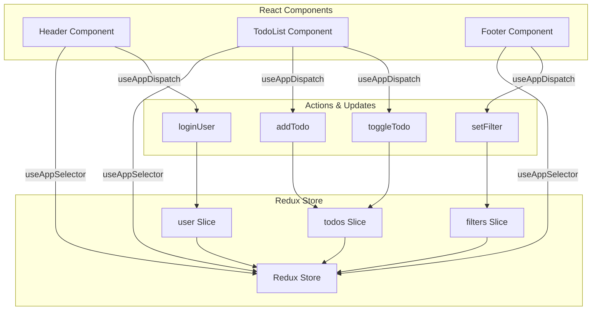

# Redux State Management Pattern

**Pattern Type:** TransferablePattern  
**Significance:** 8/10 - Essential architecture pattern for complex React applications  
**Created:** 2025-01-15  
**Updated:** 2025-06-19

## Table of Contents

- [Overview](#overview)
- [When to Use Redux](#when-to-use-redux)
- [Basic Redux Implementation](#basic-redux-implementation)
  - [Redux Architecture Overview](#redux-architecture-overview)
  - [Store Setup](#1-store-setup)
  - [Feature-Based Slices](#2-feature-based-slices)
  - [Component Usage](#3-component-usage)
- [Advanced Patterns](#advanced-patterns)
- [Implementation Checklist](#implementation-checklist)
- [References](#references)

## Overview

**Problem:** React applications with complex state management need predictable state updates, debugging capabilities, and cross-component data sharing.

**Solution:** Use Redux Toolkit with feature-based slices and typed hooks. For larger applications, consider advanced patterns like MVI architecture.

**Benefits:** Predictable state updates, time-travel debugging, persistence integration, and excellent TypeScript support.

## When to Use Redux

### ✅ Use Redux When:
- **Cross-component state sharing** is needed
- **Multiple components** need the same data
- **State updates** are becoming unpredictable
- **Debugging** complex state changes is required
- **State persistence** across sessions is needed

### ❌ Avoid Redux When:
- Simple applications with **fewer than 10 components**
- **Prototype/MVP** development
- **Static websites** with minimal interactivity
- **Simple forms** or basic UI state

## Basic Redux Implementation

### Redux Architecture Overview



### 1. Store Setup

```typescript
// store/index.ts
import { configureStore } from '@reduxjs/toolkit';
import { useDispatch, useSelector, TypedUseSelectorHook } from 'react-redux';

export const store = configureStore({
  reducer: {
    ui: uiSlice,
    data: dataSlice,
    preferences: preferencesSlice,
  },
});

export type RootState = ReturnType<typeof store.getState>;
export type AppDispatch = typeof store.dispatch;

// Typed hooks
export const useAppDispatch = () => useDispatch<AppDispatch>();
export const useAppSelector: TypedUseSelectorHook<RootState> = useSelector;
```

### 2. Feature-Based Slices

```typescript
// slices/dataSlice.ts
import { createSlice, PayloadAction } from '@reduxjs/toolkit';

interface DataState {
  items: Item[];
  loading: boolean;
  error: string | null;
}

const initialState: DataState = {
  items: [],
  loading: false,
  error: null,
};

const dataSlice = createSlice({
  name: 'data',
  initialState,
  reducers: {
    setLoading: (state, action: PayloadAction<boolean>) => {
      state.loading = action.payload;
    },
    setItems: (state, action: PayloadAction<Item[]>) => {
      state.items = action.payload;
      state.loading = false;
      state.error = null;
    },
    setError: (state, action: PayloadAction<string>) => {
      state.error = action.payload;
      state.loading = false;
    },
  },
});

export const { setLoading, setItems, setError } = dataSlice.actions;
export default dataSlice.reducer;
```

### 3. Component Usage

```typescript
// components/DataList.tsx
import { useAppSelector, useAppDispatch } from '../store';
import { setLoading, setItems } from '../slices/dataSlice';

const DataList = () => {
  const { items, loading, error } = useAppSelector(state => state.data);
  const dispatch = useAppDispatch();

  const handleLoadData = async () => {
    dispatch(setLoading(true));
    try {
      const data = await fetchData();
      dispatch(setItems(data));
    } catch (err) {
      dispatch(setError(err.message));
    }
  };

  if (loading) return <div>Loading...</div>;
  if (error) return <div>Error: {error}</div>;

  return (
    <div>
      <button onClick={handleLoadData}>Load Data</button>
      {items.map(item => <div key={item.id}>{item.name}</div>)}
    </div>
  );
};
```

## Advanced Patterns

### Async Operations with createAsyncThunk

```typescript
import { createAsyncThunk } from '@reduxjs/toolkit';

export const fetchUserData = createAsyncThunk(
  'user/fetchData',
  async (userId: string, { rejectWithValue }) => {
    try {
      const response = await fetch(`/api/users/${userId}`);
      if (!response.ok) {
        throw new Error('Failed to fetch user');
      }
      return await response.json();
    } catch (error) {
      return rejectWithValue(error.message);
    }
  }
);

// In slice
extraReducers: (builder) => {
  builder
    .addCase(fetchUserData.pending, (state) => {
      state.loading = true;
    })
    .addCase(fetchUserData.fulfilled, (state, action) => {
      state.loading = false;
      state.user = action.payload;
    })
    .addCase(fetchUserData.rejected, (state, action) => {
      state.loading = false;
      state.error = action.payload as string;
    });
}
```

### State Persistence

```typescript
// utils/persistence.ts
export const loadFromStorage = (key: string) => {
  try {
    const serialized = localStorage.getItem(key);
    return serialized ? JSON.parse(serialized) : null;
  } catch {
    return null;
  }
};

export const saveToStorage = (key: string, state: any) => {
  try {
    localStorage.setItem(key, JSON.stringify(state));
  } catch {
    // Handle storage errors silently
  }
};

// In slice
const preferencesSlice = createSlice({
  name: 'preferences',
  initialState: loadFromStorage('preferences') || defaultPreferences,
  reducers: {
    updatePreference: (state, action) => {
      const { key, value } = action.payload;
      state[key] = value;
      saveToStorage('preferences', state);
    },
  },
});
```

### Middleware Configuration

```typescript
const store = configureStore({
  reducer: rootReducer,
  middleware: (getDefaultMiddleware) =>
    getDefaultMiddleware({
      serializableCheck: {
        ignoredActions: ['persist/PERSIST', 'persist/REHYDRATE'],
        ignoredActionsPaths: ['meta.arg', 'payload.timestamp'],
        ignoredPaths: ['ui.tempData'],
      },
    }),
  devTools: process.env.NODE_ENV !== 'production',
});
```

## Implementation Checklist

### Basic Setup
- [ ] Install `@reduxjs/toolkit` and `react-redux`
- [ ] Create typed hooks (`useAppDispatch`, `useAppSelector`)
- [ ] Set up store with `configureStore`
- [ ] Organize slices by feature domain
- [ ] Configure Redux DevTools

### Advanced Features
- [ ] Implement async operations with `createAsyncThunk`
- [ ] Add state persistence if needed
- [ ] Configure middleware for specific requirements
- [ ] Set up error handling patterns
- [ ] Write tests for reducers and async thunks

### Code Quality
- [ ] Use TypeScript throughout
- [ ] Follow naming conventions
- [ ] Keep state normalized
- [ ] Avoid deeply nested state
- [ ] Document complex logic

## References

- [Redux Toolkit Documentation](https://redux-toolkit.js.org/)
- [React-Redux TypeScript Guide](https://react-redux.js.org/tutorials/typescript-quick-start)
- [Redux Style Guide](https://redux.js.org/style-guide/style-guide)
- [Redux DevTools Extension](https://github.com/reduxjs/redux-devtools)

---

*This pattern provides a solid foundation for predictable state management in React applications. Start simple and add complexity as your application grows.*