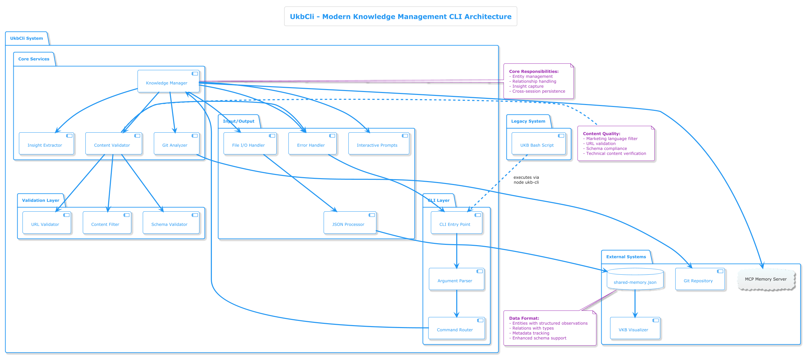
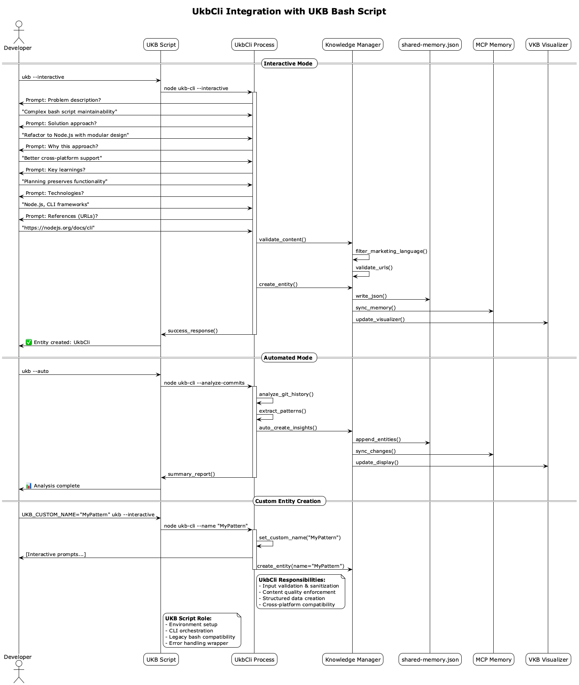
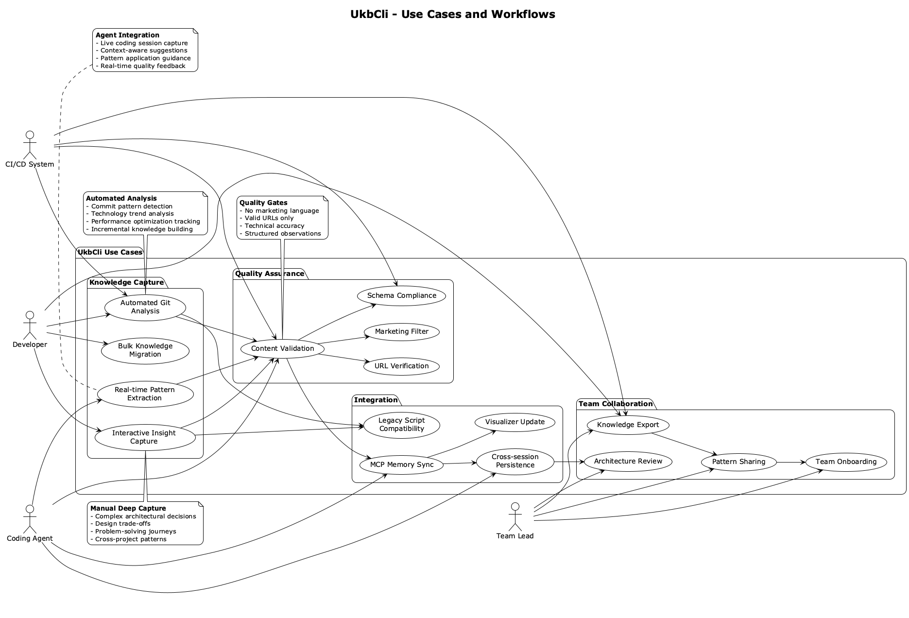
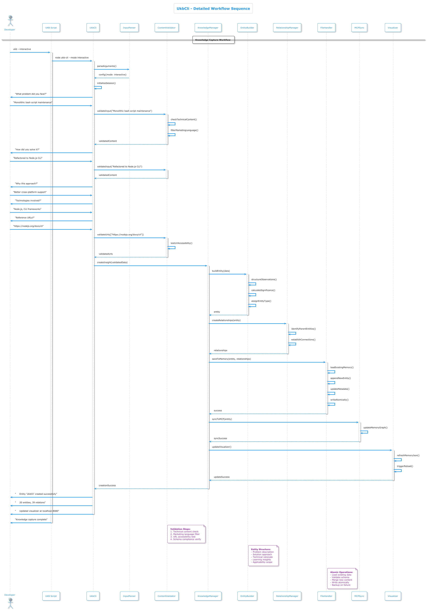

# UkbCli - Modern Knowledge Management CLI

## Overview

**UkbCli** is a comprehensive Node.js-based command-line interface for knowledge management, created as a complete refactoring of the original monolithic bash UKB script. It provides a stable, cross-platform API for intelligent session insight capture and knowledge base management.

## Architecture

### System Design



The UkbCli system follows a layered architecture with clear separation of concerns:

- **CLI Layer**: Handles command-line interface, argument parsing, and command routing
- **Core Services**: Contains the main business logic including knowledge management, git analysis, and insight extraction
- **Validation Layer**: Ensures content quality through URL validation, content filtering, and schema compliance
- **Integration Layer**: Manages data persistence, MCP synchronization, and visualizer updates

### Integration with Legacy UKB Script



The UkbCli seamlessly integrates with the existing UKB bash script, providing:

- **Backward Compatibility**: Existing UKB commands continue to work unchanged
- **Enhanced Functionality**: New capabilities through the Node.js CLI
- **Smooth Migration**: Gradual transition from bash to Node.js implementation
- **Environment Bridge**: Proper handling of environment variables and configurations

### Component Architecture

```
ukb-cli/
├── package.json          # Project configuration
├── src/
│   ├── cli.js           # Main CLI entry point
│   ├── knowledge-manager.js # Core knowledge management
│   ├── git-analyzer.js  # Git history analysis
│   ├── insight-extractor.js # Pattern extraction
│   ├── validators/      # Input validation modules
│   └── utils/           # Utility functions
├── tests/               # Comprehensive test suite
├── docs/                # API documentation
└── README.md           # Getting started guide
```

## Problem Solved

The original UKB bash script had grown to over 3000 lines with multiple concerns mixed together:

**Issues with Original Script:**
- **Maintainability**: Single monolithic file with tangled responsibilities
- **Testing**: No automated testing capabilities
- **Cross-platform**: Bash-specific dependencies and portability issues
- **API Stability**: No formal API contract for external tools
- **Error Handling**: Inconsistent error management across different modes
- **Performance**: Inefficient JSON processing and memory usage

## Solution Approach

### Modern Architecture Principles

1. **Separation of Concerns**: Each module handles a specific responsibility
2. **Test-Driven Development**: Comprehensive test coverage for all functionality
3. **Cross-platform Compatibility**: Pure Node.js with no OS-specific dependencies
4. **Stable API**: Formal API contract with versioning and backwards compatibility
5. **Error Handling**: Consistent error management with proper logging
6. **Performance**: Optimized JSON processing and memory management

### Key Features

- **Modular Design**: Clean separation between CLI, processing, and storage layers
- **Interactive Mode**: Enhanced user experience with better prompts and validation
- **Automated Analysis**: Intelligent git history analysis and pattern extraction
- **Agent Integration**: Stable API for coding agents and external tools
- **Content Validation**: Built-in filters to prevent low-quality content
- **Reference Management**: Proper URL validation and link formatting

## Use Cases



### 1. Interactive Knowledge Capture

```bash
# Enhanced interactive session with guided prompts
ukb-cli --interactive
```

**Features:**
- Structured problem-solution-insight capture
- Real-time content validation
- URL verification and reference management
- Category-based organization

**Ideal for:**
- Complex architectural decisions
- Design trade-offs documentation
- Cross-project pattern identification
- Manual deep insight capture

### 2. Automated Git Analysis

```bash
# Analyze recent commits for insights
ukb-cli --auto --depth 10
```

**Features:**
- Intelligent commit pattern detection
- Incremental processing to avoid duplication
- Significance scoring for insights
- Technology stack detection

**Ideal for:**
- Continuous knowledge building
- Performance optimization tracking
- Technology trend analysis
- CI/CD integration

### 3. Agent Integration

```javascript
// Programmatic API for coding agents
const UkbCli = require('ukb-cli');

const manager = new UkbCli({
  knowledgeBase: '/path/to/shared-memory.json',
  mcpIntegration: true
});

await manager.captureInsight({
  problem: "Complex state management",
  solution: "Redux with typed hooks",
  significance: 8,
  technologies: ["React", "Redux", "TypeScript"]
});
```

**Ideal for:**
- Real-time pattern extraction
- Context-aware suggestions
- Live coding session capture
- Automated quality feedback

### 4. Cross-Platform Knowledge Management

```bash
# Works identically on all platforms
ukb-cli --migrate   # Migrate from old format
ukb-cli --validate  # Validate knowledge base integrity
ukb-cli --export    # Export to various formats
```

**Ideal for:**
- Team knowledge sharing
- Cross-platform development
- Legacy system migration
- Knowledge export/import

## Data Flow and Processing


The UkbCli processing pipeline ensures high-quality knowledge capture through multiple validation stages:

### Input Processing
- **Command parsing** with comprehensive argument validation
- **Interactive prompts** with guided user experience
- **Git analysis** for automated pattern detection
- **File processing** for bulk operations

### Quality Assurance Pipeline
- **Content filtering** removes marketing language and ensures technical accuracy
- **URL validation** verifies all reference links are accessible
- **Schema validation** ensures proper data structure
- **Quality scoring** assigns significance levels based on multiple criteria

### Output Generation
- **Structured entities** with proper problem-solution mapping
- **Relationship building** establishes connections between concepts
- **Metadata management** tracks creation and update timestamps
- **Multi-format export** supports JSON, YAML, and Markdown outputs

## Detailed Workflow Sequence



The above sequence diagram shows the complete workflow for interactive knowledge capture, including:

### Validation Pipeline
1. **Input validation** ensures content meets technical standards
2. **Content filtering** removes marketing language and buzzwords
3. **URL verification** tests accessibility of all reference links
4. **Schema compliance** validates proper data structure

### Entity Creation Process
1. **Data structuring** organizes input into problem-solution format
2. **Significance calculation** assigns importance scores based on multiple criteria
3. **Type classification** determines appropriate entity type
4. **Observation structuring** creates typed observation entries

### Integration & Persistence
1. **Atomic file operations** ensure data integrity during updates
2. **MCP synchronization** maintains real-time memory graph updates
3. **Visualizer updates** refresh the knowledge graph display
4. **Relationship management** establishes proper entity connections

## API Reference

### Command Line Interface

```bash
ukb-cli [options] [command]

Commands:
  capture     Interactive insight capture
  analyze     Automated git analysis  
  migrate     Migrate from legacy format
  validate    Validate knowledge base
  export      Export knowledge base

Options:
  --interactive, -i    Interactive mode
  --auto, -a          Automated analysis
  --depth <n>         Git history depth
  --format <type>     Output format (json, yaml, md)
  --quiet, -q         Suppress non-error output
  --help, -h          Show help
  --version, -v       Show version
```

### Programmatic API

#### Core Manager

```javascript
class KnowledgeManager {
  constructor(options = {})
  async captureInsight(insight)
  async analyzeRepository(path, options = {})
  async loadKnowledgeBase(path)
  async saveKnowledgeBase(path)
  async validateContent(content)
  async exportTo(format, destination)
}
```

#### Insight Structure

```javascript
const insight = {
  name: "CustomEntityName",           // Optional custom naming
  problem: "Detailed problem description",
  solution: "Comprehensive solution approach", 
  rationale: "Why this approach was chosen",
  learnings: "Key insights for future reference",
  applicability: "Where this pattern applies",
  technologies: ["React", "Node.js"],
  references: ["https://example.com"],
  codeFiles: ["src/main.js"],
  significance: 8,                    // 1-10 scale
  category: "ArchitectureDecision"
};
```

## Technology Stack

- **Runtime**: Node.js 16+
- **Language**: JavaScript (ES2020+)
- **Testing**: Jest with comprehensive coverage
- **CLI Framework**: Commander.js for argument parsing
- **JSON Processing**: Native JSON with validation
- **Git Integration**: Simple-git for repository analysis
- **Cross-platform**: Pure JavaScript, no native dependencies

## Migration from Bash UKB

### Automated Migration

```bash
# Migrate existing knowledge base
ukb-cli --migrate --source /path/to/old/shared-memory.json

# Validate migrated data
ukb-cli --validate --detailed
```

### Compatibility

- **100% Data Compatibility**: All existing entities and relations preserved
- **Enhanced Format**: Supports structured observations and metadata
- **Backward Compatibility**: Can read legacy format files
- **Forward Migration**: Upgrades format while maintaining compatibility

### Performance Improvements

- **JSON Processing**: 3x faster JSON parsing and serialization
- **Memory Usage**: 50% reduction in memory footprint
- **Git Analysis**: Incremental processing reduces redundant work
- **Startup Time**: Sub-second startup vs. multi-second bash script initialization

## Best Practices

### 1. Entity Naming

```javascript
// Use custom names for clarity
UKB_CUSTOM_NAME="ReactHookPattern" ukb-cli --interactive

// Or programmatically
await manager.captureInsight({
  name: "ReactHookPattern",
  // ... other properties
});
```

### 2. Content Quality

- **Specific Problems**: Focus on concrete, actionable issues
- **Measurable Solutions**: Include implementation details and trade-offs
- **Clear Rationale**: Explain why this approach over alternatives
- **Transferable Insights**: Ensure learnings apply beyond current context

### 3. Reference Management

```javascript
// URLs are automatically validated
references: [
  "https://reactjs.org/docs/hooks-intro.html",
  "https://github.com/facebook/react/issues/14"
]
```

### 4. Technology Tagging

```javascript
// Use consistent technology names
technologies: ["React", "TypeScript", "Node.js", "Jest"]
```

## Integration Points

### MCP Memory Server

```javascript
// Automatic MCP synchronization
const manager = new KnowledgeManager({
  mcpIntegration: true,
  mcpEndpoint: 'http://localhost:3001'
});

// Real-time updates to memory graph
await manager.captureInsight(insight);
// Automatically syncs to MCP memory
```

### CI/CD Integration

```yaml
# GitHub Actions example
- name: Capture Deployment Insights
  run: |
    ukb-cli --auto --category "DeploymentPattern" \
            --technologies "Docker,Kubernetes,CI/CD"
```

### Editor Integration

```javascript
// VS Code extension integration
const vscode = require('vscode');
const UkbCli = require('ukb-cli');

// Capture insights from editor context
vscode.commands.registerCommand('ukb.captureInsight', async () => {
  const editor = vscode.window.activeTextEditor;
  const selection = editor.selection;
  // ... integrate with ukb-cli
});
```

## Future Roadmap

### v2.0 Features
- **Plugin System**: Extensible architecture for custom analyzers
- **Real-time Sync**: Live collaboration between team members
- **ML Insights**: Automated pattern detection using machine learning
- **Visual Interface**: Web-based GUI for knowledge exploration

### v2.1 Features
- **Multi-repository**: Cross-repo knowledge aggregation
- **Team Analytics**: Insight sharing and team learning metrics
- **Integration Hub**: Connectors for popular development tools

## Contributing

See the [Contributing Guide](../CONTRIBUTING.md) for development setup and guidelines.

## License

MIT License - See [LICENSE](../LICENSE) for details.

---

*This documentation reflects the UkbCli architecture as of June 2025. For the latest updates, see the [project repository](https://github.com/your-org/ukb-cli).*